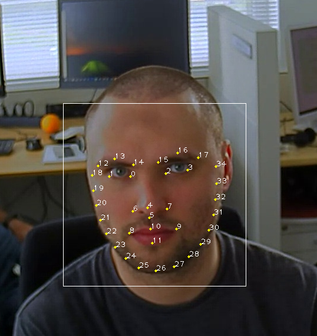

# facial-landmarks-35-adas-0002

## Use Case and High-Level Description

This is a custom-architecture convolutional neural network for 35 facial landmarks estimation.

## Example and Landmarks Definition

[Left Eye]
**p0, p1**: corners of the eye, located on the boundary of the eyeball and the eyelid.

[Right Eye]
**p2, p3**: corners of the eye, located on the boundary of the eyeball and the eyelid.

[Nose]
**p4**: nose-tip point; **p5**: lowest point of the nasal septum; **p6, p7**: right-bottom and left-bottom of the nose wing.

[Mouth]
**p8, p9**: mouth corners on the outer boundary of the lip; **p10, p11**: center points along the outer boundary of the lip.

[Left Eyebrow]
**p12**: starting point of the upper boundary of the eyebrow;  **p13**: mid-point of the upper arc of the eyebrow; **p14**: ending point of the upper boundary of the eyebrow.

[Right Eyebrow]
**p15**: starting point of the upper boundary of the eyebrow;  **p16**: mid-point of the upper arc of the eyebrow; **p17**: ending point of the upper boundary of the eyebrow.

[Face Contour]
**p26**: chin center; **p18, p34**: upper points of the face contour aligned with the outer corners of the eyes;
**p19~p25**: boundary points, evenly distributed along the curve p18-p26;
**p27~p33**: boundary points, evenly distributed along the curve p26-p34.

## Specification

| Metric                | Value                                       |
|-----------------------|---------------------------------------------|
| GFlops                | 0.042                                       |
| MParams               | 4.595                                       |
| Source framework      | Caffe\*                                     |

## Validation Dataset

A 1000-sample random subset of a large internal dataset containing images of 300 people with different facial expressions.

## Validation Results

The quality of landmarks' positions prediction is evaluated through the use of Normed Error (NE). The error for the ith sample has the form:

where N is the number of landmarks, _p_-hat and _p_ are, correspondingly, the prediction and ground truth vectors of the kth landmark of the ith sample, and di is the interocular distance for the ith sample.

| Dataset          | Mean NE | 90th [Percentile](https://en.wikipedia.org/wiki/Percentile) NE |[Standard deviation](https://en.wikipedia.org/wiki/Standard_deviation) of NE |
|------------------|---------|---------------------------------------------------------------------------|-----------------------------------------------------------------------------|
| Internal dataset | 0.106   | 0.143                                                                     | 0.038                                                                       |

## Inputs

Image, name: `data`, shape: `1, 3, 60, 60` in the format `B, C, H, W`, where:

- `B` - batch size
- `C` - number of channels
- `H` - image height
- `W` - image width

## Outputs

The net outputs a blob `align_fc3` with the shape: `1, 70`, containing row-vector of 70 floating point values for 35 landmarks' normed coordinates in the form (x0, y0, x1, y1, ..., x34, y34).

## Legal Information
[*] Other names and brands may be claimed as the property of others.
