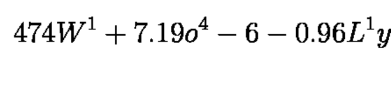

# formula-recognition-medium-scan-0001 (composite)

## Use Case and High-Level Description

This is an im2latex composite model that recognizes latex formulas.
The model uses vocabulary file `vocab.json` to predict sequence of latex tokens.
The model is built on the resnext50 backbone with additional attention-based text recognition head.

Vocabulary file is located under corresponding model configuration directory, `<omz_dir>/models/intel/formula-recognition-medium-scan-0001/vocab.json`. Model can predict big and small letters, numbers, some greek letters, trigonometric functions (e.g. cos, sin, coth), logarithmic function, sqrt and superscript.

## Example of the input data

## Example of the output

`4 7 4 W ^ { 1 } + 7 . 1 9 o ^ { 4 } - 6 - 0 . 9 6 L ^ { 1 } y `

## Composite model specification

| Metric                                        | Value     |
|-----------------------------------------------|-----------|
| im2latex_medium_photographed dataset, im2latex-match-images metric | 81.5% |
| im2latex_medium_rendered dataset, im2latex-match-images metric | 95.7% |
| Source framework                              | PyTorch\* |

Im2latex-match-images metric is calculated by [this algorithm](../../../../tools/accuracy_checker/accuracy_checker/metrics/im2latex_images_match.py )

## Encoder model specification

The formula-recognition-medium-scan-0001-encoder model is a ResNeXt-50 like backbone with some initialization layers for decoder

| Metric                                        | Value     |
|-----------------------------------------------|-----------|
| GFlops                                        | 16.56     |
| MParams                                       | 1.69      |

### Inputs

1.	Name: `imgs` , shape: [1x3x160x1400]. An input image in the [1xCxHxW] format.
    The expected channel order is BGR.

### Outputs
1.	Name: `hidden`, shape: [1x512]. Initial context state of the LSTM cell.
2.	Name: `context`, shape: [1x512]. Initial hidden state of the LSTM cell.
3.	Name: `init_0`, shape: [1x256]. Initial state of the decoder.
5.	Name: `row_enc_out`, shape: [1x20x75x512]. Features from encoder that are fed to a decoder.

## Decoder model specification

The formula-recognition-medium-scan-0001-decoder model is an LSTM based decoder with attention module.

| Metric                                        | Value     |
|-----------------------------------------------|-----------|
| GFlops                                        | 1.86     |
| MParams                                       | 2.56      |

### Inputs

1.	Name: `dec_st_c` , shape: [1x512]. Current context state of the LSTM cell.
2.	Name: `dec_st_h` , shape: [1x512]. Current hidden state of the LSTM cell.
3.	Name: `output_prev`, shape: [1x256]. Current state of the decoder.
4.	Name: `row_enc_out`, shape: [1x20x175x512]. Encoded features.
5.	Name: `tgt`, shape: [1x1]. Index of the previous symbol.

### Outputs

1.	Name: `dec_st_c` , shape: [1x512]. Current context state of the LSTM cell.
2.	Name: `dec_st_h` , shape: [1x512]. Current hidden state of the LSTM cell.
3.	Name: `output`, shape: [1x256]. Current state of the decoder.
1.	Name: `logit`, shape: [1xVocab_Size]. Classification confidence scores in the [0, 1] range
    for every token.

## Legal Information
[*] Other names and brands may be claimed as the property of others.
