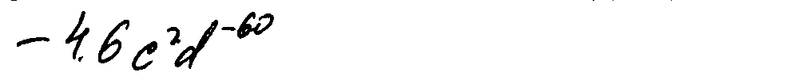

# formula-recognition-polynomials-handwritten-0001 (composite)

## Use Case and High-Level Description

This is an im2latex composite model that recognizes latex formulas.
The model uses vocabulary file `vocab.json` to predict sequence of latex tokens.
The model is built on the ResNeXt-50 backbone with additional attention-based text recognition head.
The model was trained on internal Intel's dataset containing images of handwritten polynomial equations.
The equations consist of tokens from the corresponding to this model vocabulary file.

Vocabulary file is located under corresponding model configuration directory, `<omz_dir>/models/intel/formula-recognition-polynomials-handwritten-0001/vocab.json`. Model can predict letters, numbers and upperscript.

## Example of the input data

## Example of the output

`- 4 . 6 c ^ { 2 } d ^ { - 6 0 }`

## Composite model specification

| Metric                                                                 | Value     |
|------------------------------------------------------------------------|-----------|
| im2latex_polynomials_handwritten dataset, im2latex-match-images metric | 70.5%     |
| Source framework                                                       | PyTorch\* |

Im2latex-match-images metric is calculated by [this algorithm](../../../tools/accuracy_checker/accuracy_checker/metrics/im2latex_images_match.py )

## Encoder model specification

The formula-recognition-polynomials-handwritten-0001-encoder model is a ResNeXt-50 like backbone with some initialization layers for decoder

| Metric                                        | Value     |
|-----------------------------------------------|-----------|
| GFlops                                        | 12.8447   |
| MParams                                       | 8.6838    |

### Inputs

Image, name: `imgs`, shape: `1, 3, 96, 990` in the `1, C, H, W` format, where:

- `C` - number of channels
- `H` - image height
- `W` - image width

The expected channel order is `BGR`.

### Outputs

1.	Name: `hidden`, shape: `1, 512`. Initial context state of the LSTM cell.
2.	Name: `context`, shape: `1, 512`. Initial hidden state of the LSTM cell.
3.	Name: `init_0`, shape: `1, 256`. Initial state of the decoder.
4.	Name: `row_enc_out`, shape: `1, 6, 62, 512`. Features from encoder that are fed to a decoder.

## Decoder model specification

The formula-recognition-polynomials-handwritten-0001-decoder model is an LSTM based decoder with attention module.

| Metric                                        | Value     |
|-----------------------------------------------|-----------|
| GFlops                                        | 0.2017    |
| MParams                                       | 2.5449    |

### Inputs

1.	Name: `dec_st_c`, shape: `1, 512`. Current context state of the LSTM cell.
2.	Name: `dec_st_h`, shape: `1, 512`. Current hidden state of the LSTM cell.
3.	Name: `output_prev`, shape: `1, 256`. Current state of the decoder.
4.	Name: `row_enc_out`, shape: `1, 6, 62, 512`. Encoded features.
5.	Name: `tgt`, shape: `1, 1`. Index of the previous symbol.

### Outputs

1.	Name: `dec_st_c`, shape: `1, 512`. Current context state of the LSTM cell.
2.	Name: `dec_st_h`, shape: `1, 512`. Current hidden state of the LSTM cell.
3.	Name: `output`, shape: `1, 256`. Current state of the decoder.
4.	Name: `logit`, shape: `1, N`, where `N` is a vocabulary size. Classification confidence scores in the [0, 1] range
    for every token.

## Legal Information
[*] Other names and brands may be claimed as the property of others.
