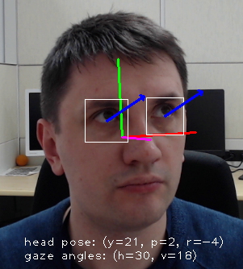

# gaze-estimation-adas-0002

## Use Case and High-Level Description

This is a custom VGG-like convolutional neural network for gaze direction estimation.

## Example and Gaze Vector Definition

The network takes three inputs: square crop of left eye image, square crop of right eye image, and three head pose angles -- (yaw, pitch, and roll) (see figure). The network outputs 3-D vector corresponding to the direction of a person's gaze in a Cartesian coordinate system in which z-axis is directed from person's eyes (mid-point between left and right eyes' centers) to the camera center, y-axis is vertical, and x-axis is orthogonal to both z,y axes so that (x,y,z) constitute a right-handed coordinate system.

## Specification

| Metric                | Value                                       |
|-----------------------|---------------------------------------------|
| GFlops                | 0.139                                       |
| MParams               | 1.882                                       |
| Source framework      | Caffe2                                      |

## Validation Dataset

Two random held out inviduals from an internal dataset containing images of 60 people with different gaze directions.

## Validation Results

The accuracy of gaze direction prediction is evaluated through the use of [MAE](https://en.wikipedia.org/wiki/Mean_absolute_error) of angle (in degrees) between the ground truth and predicted gaze direction.

| Dataset | [MAE](https://en.wikipedia.org/wiki/Mean_absolute_error), degrees | [Standard deviation](https://en.wikipedia.org/wiki/Standard_deviation) of AE, degrees |
| - | - | - |
| Internal dataset | 6.95 | 3.58 |

## Inputs

* Blob in the format [BxCxHxW]
   where:
   * B - batch size
   * C - number of channels
   * H - image height
   * W - image width

with the name `left_eye_image` and the shape [1x3x60x60].

* Blob in the format [BxCxHxW]
   where:
   * B - batch size
   * C - number of channels
   * H - image height
   * W - image width

with the name `right_eye_image` and the shape [1x3x60x60].

* Blob in the format [BxC]
   where:
   * B - batch size
   * C - number of channels

with the name `head_pose_angles` and the shape [1x3].

## Outputs

The net outputs a blob with the shape: [1, 3], containing Cartesian coordinates of gaze direction vector. Please note that the output vector is not normalizes and has non-unit length.

Output layer name in Inference Engine format:

`gaze_vector`

Output layer name in Caffe2 format:

`gaze_vector`

## Legal Information
[*] Other names and brands may be claimed as the property of others.
