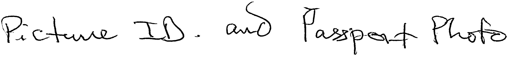

# handwritten-english-recognition-0001

## Use Case and High-Level Description

This is a network for handwritten English text recognition scenario. It consists of a CNN followed by Bi-LSTM, reshape layer and a fully connected layer.
The network is able to recognize English text consisting of characters in the [GNHK](https://goodnotes.com/gnhk/) dataset.

## Example

 -> 'Picture ID. and Passport photo'

## Specification

| Metric                    | Value     |
| ------------------------- | --------- |
| GFlops                    | 1.3182    |
| MParams                   | 0.1413    |
| Accuracy on GNHK test subset (excluding images wider than 2000px after resized to height 96px with aspect ratio) | 81.5%     |
| Source framework          | PyTorch\* |

> **Note:** to achieve the accuracy, images from the GNHK test set should be preprocessed into single-line text images, using the coordinates from the accompanying JSON annotation files in the GNHK dataset, and then binarized using adaptive thresholding.

## Accuracy Values

This demo adopts [label error rate](https://dl.acm.org/doi/abs/10.1145/1143844.1143891) as the metric for accuracy.

## Inputs

Grayscale image, name - `actual_input`, shape - `1, 1, 96, 2000`, format is `B, C, H, W`, where:

- `B` - batch size
- `C` - number of channels
- `H` - image height
- `W` - image width

> **NOTE:**  the source image should be resized to specific height (such as 96) while keeping aspect ratio, and the width after resizing should be no larger than 2000 and then the width should be right-bottom padded to 2000 with edge values.

## Outputs

Name - `output`, shape - `250, 1, 95`, format is `W, B, L`, where:

- `W` - output sequence length
- `B` - batch size
- `L` - confidence distribution across the supported symbols in [GNHK](https://goodnotes.com/gnhk/)

The network output can be decoded by CTC Greedy Decoder.

## Legal Information

[*] Other names and brands may be claimed as the property of others.
