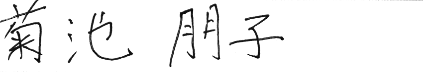

# handwritten-japanese-recognition-0001

## Use Case and High-Level Description

This is a network for handwritten Japanese text recognition scenario. It consists of a VGG16-like backbone, 
reshape layer and a fully connected layer.
The network is able to recognize Japanese text consisting of characters in the [Kondate](http://web.tuat.ac.jp/~nakagawa/database/en/kondate_about.html) and [Nakayosi](http://web.tuat.ac.jp/~nakagawa/database/en/about_nakayosi.html) datasets.

## Example

 -> 菊池朋子

## Specification

| Metric                                         | Value              |
|------------------------------------------------|--------------------|
| GFlops                                         | 117.136            |
| MParams                                        | 15.31              |
| Accuracy on Kondate test set and test set generated from Nakayosi           | 98.16%             |
| Source framework                               | PyTorch\*          |

## Accuracy Values

This demo adopts [label error rate](https://dl.acm.org/doi/abs/10.1145/1143844.1143891) as the metric for accuracy.

## Inputs

Shape: [1x1x96x2000] - An input image in the format [BxCxHxW],
where:
  - B - batch size
  - C - number of channels
  - H - image height
  - W - image width

Note that the source image should be converted to grayscale, resized to specific height (such as 96) while keeping aspect ratio, and right-bottom padded.

## Outputs

The net outputs a blob with the shape [186, 1, 4442] in the format [WxBxL], where:
  - W - output sequence length
  - B - batch size
  - L - confidence distribution across the supported symbols in [Kondate](http://web.tuat.ac.jp/~nakagawa/database/en/kondate_about.html) and [Nakayosi](http://web.tuat.ac.jp/~nakagawa/database/en/about_nakayosi.html).

The network output can be decoded by CTC Greedy Decoder.

## Legal Information
[*] Other names and brands may be claimed as the property of others.
