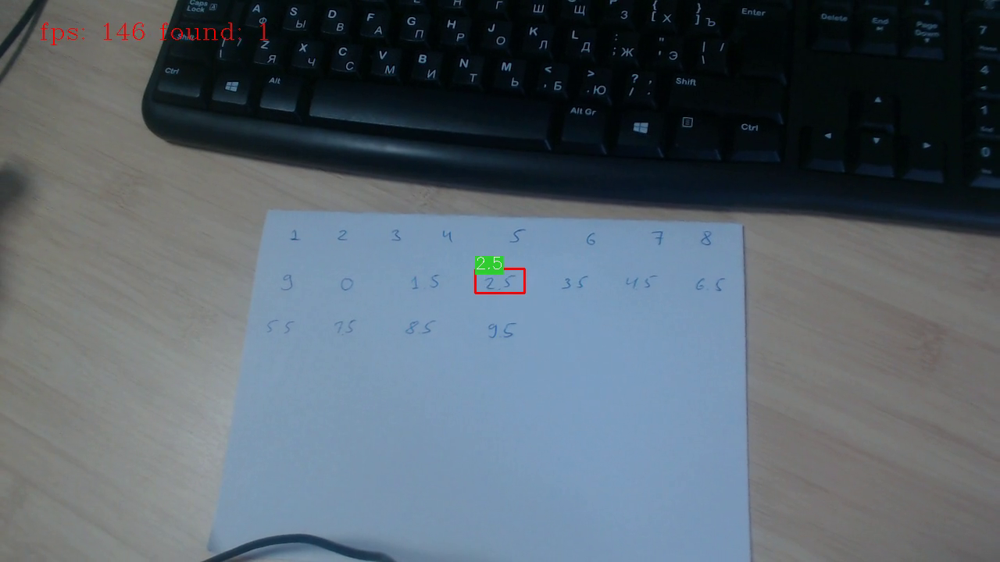

# handwritten-score-recognition-0003

## Use Case and High-Level Description

This is a network for text recognition scenario. It consists of VGG16-like backbone and bidirectional LSTM encoder-decoder.
The network is able to recognize school marks that should have format either `<digit>` or `<digit>.<digit>`
(e.g. `4` or `3.5`).

## Example

 -> Mark2.5

## Specification

| Metric                                         | Value              |
|------------------------------------------------|--------------------|
| Accuracy (internal test set)                   | 98.83%             |
| Text location requirements                     | Tight aligned crop |
| GFlops                                         | 0.792              |
| MParams                                        | 5.555              |
| Source framework                               | TensorFlow\*       |

## Inputs

Image, name: `Placeholder`, shape: `1, 32, 64, 1` in the format `B, H, W, C`, where:

- `B` - batch size
- `H` - image height
- `W` - image width
- `C` - number of channels

Note that the source image should be tight aligned crop with detected text converted to grayscale.

## Outputs

The net outputs a blob with the shape `16, 1, 13` in the format `W, B, L`, where:

- `W` - output sequence length
- `B` - batch size
- `L` - confidence distribution across the alphabet: `"0123456789._#"`, where # - special blank character for CTC decoding algorithm and the character `'_'` replaces all non-numeric symbols.

The network output can be decoded by CTC Greedy Decoder or CTC Beam Search decoder.

## Demo usage

The model can be used in the following demos provided by the Open Model Zoo to show its capabilities:

* [Text Detection C++ Demo](../../../demos/text_detection_demo/cpp/README.md)

## Legal Information
[*] Other names and brands may be claimed as the property of others.
