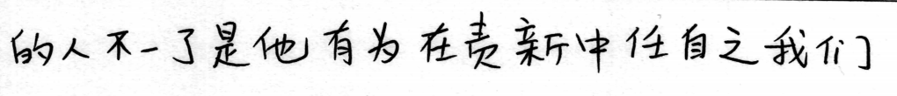

# handwritten-simplified-chinese-recognition-0001

## Use Case and High-Level Description

This is a network for handwritten simplified Chinese text recognition scenario. It consists of a VGG16-like backbone,
reshape layer and a fully connected layer.
The network is able to recognize simplified Chinese text consisting of characters in the [SCUT-EPT](https://github.com/HCIILAB/SCUT-EPT_Dataset_Release) dataset.

## Example

 -> 的人不一了是他有为在责新中任自之我们

## Specification

| Metric                                                                                                               | Value      |
|----------------------------------------------------------------------------------------------------------------------|------------|
| GFlops                                                                                                               | 134.513    |
| MParams                                                                                                              | 17.270     |
| Accuracy on SCUT-EPT test subset (excluding images wider than 2000px after resized to height 96px with aspect ratio) | 75.31%     |
| Source framework                                                                                                     | PyTorch\*  |

## Accuracy Values

This model adopts [label error rate](https://dl.acm.org/doi/abs/10.1145/1143844.1143891) as the metric for accuracy.

## Inputs

Grayscale image, name - `actual_input`, shape - `1, 1, 96, 2000`, format is `B, C, H, W`, where:

- `B` - batch size
- `C` - number of channels
- `H` - image height
- `W` - image width

> **NOTE:**  the source image should be resized to specific height (such as 96) while keeping aspect ratio, and the width after resizing should be no larger than 2000 and then the width should be right-bottom padded to 2000 with edge values.

## Outputs

Name - `output`, shape - `125, 1, 4059`, format is `W, B, L`, where:

- `W` - output sequence length
- `B` - batch size
- `L` - confidence distribution across the supported symbols in [SCUT-EPT](https://github.com/HCIILAB/SCUT-EPT_Dataset_Release).

The network output can be decoded by CTC Greedy Decoder.

## Legal Information
[*] Other names and brands may be claimed as the property of others.
