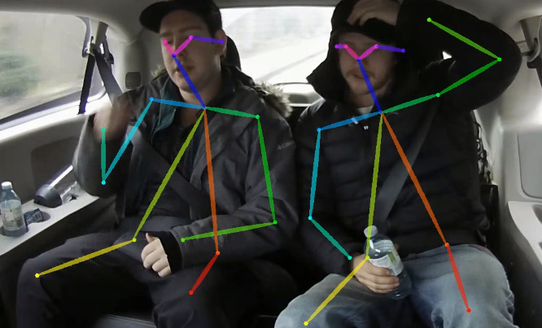

# human-pose-estimation-0001

## Use Case and High-Level Description

This is a multi-person 2D pose estimation network (based on the OpenPose approach) with tuned MobileNet v1 as a feature extractor. 
For every person in an image, the network detects a human pose: a body skeleton consisting of keypoints and connections between them.
The pose may contain up to 18 keypoints: ears, eyes, nose, neck, shoulders, elbows, wrists, hips, knees, and ankles.

## Example

## Specification

| Metric                          | Value                                     |
|---------------------------------|-------------------------------------------|
| Average Precision (AP)          | 42.8%                                     |
| GFlops                          | 15.435                                    |
| MParams                         | 4.099                                     |
| Source framework                | Caffe*                                    |

Average Precision metric described in [COCO Keypoint Evaluation site](http://cocodataset.org/#keypoints-eval).

Tested on a COCO validation subset from the original paper [Realtime Multi-Person 2D Pose Estimation using Part Affinity Fields](https://arxiv.org/abs/1611.08050).

## Performance

## Inputs

Name: `input`, shape: [1x3x256x456]. An input image in the [BxCxHxW] format ,
where:
  - B - batch size
  - C - number of channels
  - H - image height
  - W - image width
Expected color order is BGR.

## Outputs

The net outputs two blobs with the [1, 38, 32, 57] and [1, 19, 32, 57] shapes. The first blob contains keypoint pairwise relations (part affinity fields), while the second blob contains keypoint heatmaps.

## Legal Information
[*] Other names and brands may be claimed as the property of others.
