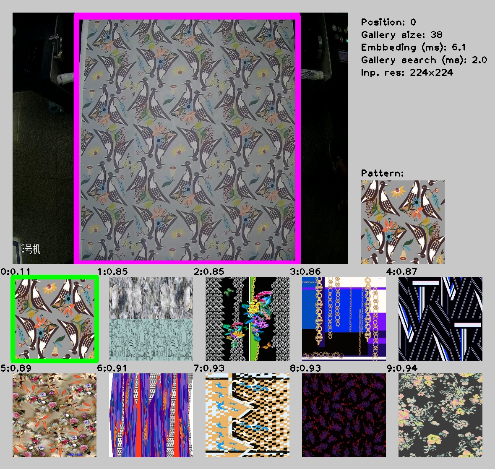

# image-retrieval-0001

## Use Case and High-Level Description

Image retrieval model based on [MobileNetV2](https://arxiv.org/abs/1801.04381) architecture as a backbone.

## Example

## Specification

| Metric                                                        | Value                   |
|---------------------------------------------------------------|-------------------------|
| Top1 accuracy                                                 | 0.834                   |
| GFlops                                                        | 0.613                   |
| MParams                                                       | 2.535                   |
| Source framework                                              | TensorFlow\*            |

## Inputs

Image, name: `input`, shape: `1, 3, 224, 224` in the format `B, C, H, W`, where:

- `B` - batch size
- `C` - number of channels
- `H` - image height
- `W` - image width

Expected color order: `BGR`.

## Outputs

Tensor with name `model/tf_op_layer_l2_normalize/l2_normalize` and the shape `1, 256` — image embedding vector.

## Legal Information
[*] Other names and brands may be claimed as the property of others.
