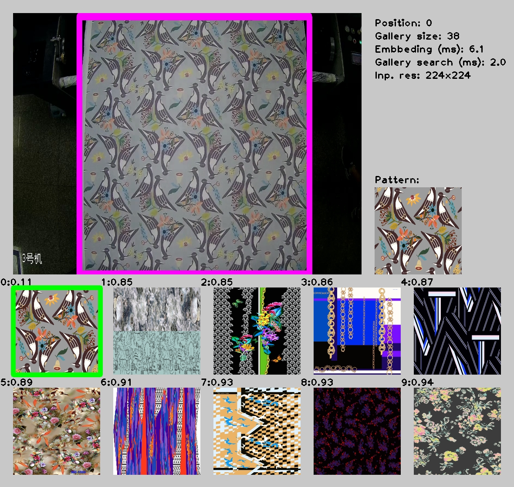

# image-retrieval-0001

## Use Case and High-Level Description

Image retrieval model based on [MobileNetV2](https://arxiv.org/abs/1801.04381) architecture as a backbone.

## Example

## Specification

| Metric                                                        | Value                   |
|---------------------------------------------------------------|-------------------------|
| Top1 accuracy                                                 | 0.834                   |
| GFlops                                                        | 0.613                   |
| MParams                                                       | 2.535                   |
| Source framework                                              | TensorFlow\*            |

## Performance

## Inputs

Name: `input`, shape: [1x3x224x224] — An input image in the format [BxCxHxW],
where:

   - B - batch size
   - C - number of channels
   - H - image height
   - W - image width

Expected color order: BGR.

## Outputs

One [1x256]-shaped tensor — image embedding vector.

## Legal Information
[*] Other names and brands may be claimed as the property of others.
