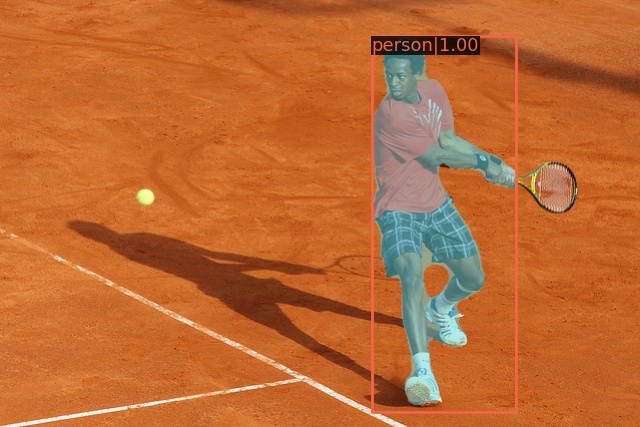

# instance-segmentation-person-0007

## Use Case and High-Level Description

This model is an instance segmentation network for one class - person.
It is a PointRend based architecture with EfficientNet-B1 backbone, light-weight FPN, RPN,
detection and segmentation heads.

## Example

## Specification

| Metric                          | Value                                     |
|---------------------------------|-------------------------------------------|
| COCO val2017 box AP (person)    | 35.7%                                     |
| COCO val2017 mask AP (person)   | 30.9%                                     |
| Max objects to detect           | 10                                        |
| GFlops                          | 4.8492                                    |
| MParams                         | 7.2996                                    |
| Source framework                | PyTorch\*                                 |

Average Precision (AP) is defined and measured according to standard
[COCO evaluation procedure](https://cocodataset.org/#detection-eval).

## Inputs

Image, name: `image`, shape: `1, 3, 320, 544` in the format `1, C, H, W`, where:

- `C` - number of channels
- `H` - image height
- `W` - image width

The expected channel order is `BGR`

## Outputs

Model has outputs with dynamic shapes.

1. Name: `labels`, shape: `-1` - Contiguous integer class ID for every
   detected object.
2. Name: `boxes`, shape: `-1, 5` - Bounding boxes around every detected objects
   in (top_left_x, top_left_y, bottom_right_x, bottom_right_y) format and its
   confidence score in range [0, 1].
3. Name: `masks`, shape: `-1, 224, 224` - Segmentation heatmaps for every output
   bounding box.

## Training Pipeline

The OpenVINO [Training Extensions](https://github.com/openvinotoolkit/training_extensions/blob/misc/README.md) provide a [training pipeline](https://github.com/openvinotoolkit/training_extensions/blob/misc/models/instance_segmentation/model_templates/custom-instance-segmentation/readme.md), allowing to fine-tune the model on custom dataset.

## Demo usage

The model can be used in the following demos provided by the Open Model Zoo to show its capabilities:

* [Background subtraction Python\* Demo](../../../demos/background_subtraction_demo/python/README.md)
* [Instance Segmentation Python\* Demo](../../../demos/instance_segmentation_demo/python/README.md)

## Legal Information

[*] Other names and brands may be claimed as the property of others.
