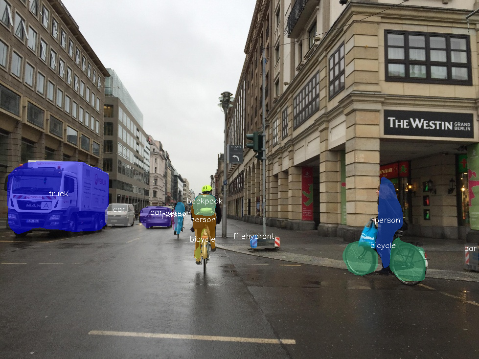

# instance-segmentation-security-0002

## Use Case and High-Level Description

This model is an instance segmentation network for 80 classes of objects.
It is a Mask R-CNN with ResNet50 backbone, FPN, RPN, detection and
segmentation heads.

## Example

## Specification

| Metric                                                              | Value                                     |
|---------------------------------------------------------------------|-------------------------------------------|
| COCO val2017 box AP (max short side 768, max long side 1024)        | 40.8%                                     |
| COCO val2017 mask AP (max short side 768, max long side 1024)       | 36.9%                                     |
| COCO val2017 box AP (max height 768, max width 1024)                | 39.86%                                    |
| COCO val2017 mask AP (max height 768, max width 1024)               | 36.44%                                    |
| Max objects to detect                                               | 100                                       |
| GFlops                                                              | 423.0842                                  |
| MParams                                                             | 48.3732                                   |
| Source framework                                                    | PyTorch\*                                 |

Average Precision (AP) is defined and measured according to standard
[COCO evaluation procedure](https://cocodataset.org/#detection-eval).

## Inputs

Image, name: `image`, shape: `1, 3, 768, 1024` in the format `1, C, H, W`, where:

- `C` - number of channels
- `H` - image height
- `W` - image width

The expected channel order is `BGR`.

## Outputs

Model has outputs with dynamic shapes.

1. Name: `labels`, shape: `-1` - Contiguous integer class ID for every
   detected object.
2. Name: `boxes`, shape: `-1, 5` - Bounding boxes around every detected objects
   in (top_left_x, top_left_y, bottom_right_x, bottom_right_y) format and its
   confidence score in range [0, 1].
3. Name: `masks`, shape: `-1, 28, 28` - Segmentation heatmaps for every output
   bounding box.

## Training Pipeline

The OpenVINO [Training Extensions](https://github.com/openvinotoolkit/training_extensions/blob/misc/README.md) provide a [training pipeline](https://github.com/openvinotoolkit/training_extensions/blob/misc/models/instance_segmentation/model_templates/coco-instance-segmentation/readme.md), allowing to fine-tune the model on custom dataset.

## Demo usage

The model can be used in the following demos provided by the Open Model Zoo to show its capabilities:

* [Instance Segmentation Python\* Demo](../../../demos/instance_segmentation_demo/python/README.md)
* [Multi Camera Multi Target Python\* Demo](../../../demos/multi_camera_multi_target_tracking_demo/python/README.md)
* [Whiteboard Inpainting Python\* Demo](../../../demos/whiteboard_inpainting_demo/python/README.md)

## Legal Information
[*] Other names and brands may be claimed as the property of others.
