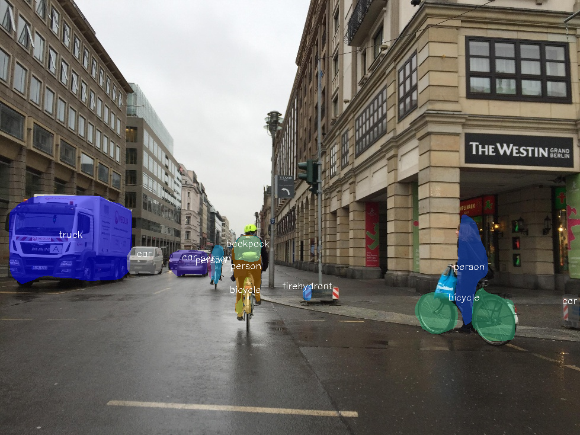

# instance-segmentation-security-1025

## Use Case and High-Level Description

This model is an instance segmentation network for 80 classes of objects.
Mask R-CNN with Oct0.5ResNet50 backbone, FPN, light-weight RPN,
SERes detection head, and dual attention segmentation head.

## Example

## Specification

| Metric                          | Value                                     |
|---------------------------------|-------------------------------------------|
| MS COCO val2017 box AP          | 32.99%                                    |
| MS COCO val2017 mask AP         | 28.37%                                    |
| Max objects to detect           | 100                                       |
| GFlops                          | 30.146                                    |
| MParams                         | 26.690                                    |
| Source framework                | PyTorch\*                                 |

Average Precision (AP) is defined and measured according to the standard
[MS COCO evaluation procedure](http://cocodataset.org/#detection-eval).

## Performance

## Inputs

1.	Name: `im_data`, shape: [1x3x480x480] - An input image in the format
    [1xCxHxW]. The expected channel order is BGR.
2.	Name: `im_info`, shape: [1x3] - Image information: processed image height,
    processed image width and processed image scale
    with respect to the original image resolution.

## Outputs

1.	Name: `classes`, shape: [100, ] - Contiguous integer class ID for every
    detected object, `0` for background, that is, for no object
2.	Name: `scores`: shape: [100, ] - Detection confidence scores in the range [0, 1]
    for every object
3.	Name: `boxes`, shape: [100, 4] - Bounding boxes around every detected objects
    in the (top_left_x, top_left_y, bottom_right_x, bottom_right_y) format
4.	Name: `raw_masks`, shape: [100, 81, 14, 14] - Segmentation heatmaps for all
    classes for every output bounding box

## Legal Information
[*] Other names and brands may be claimed as the property of others.
