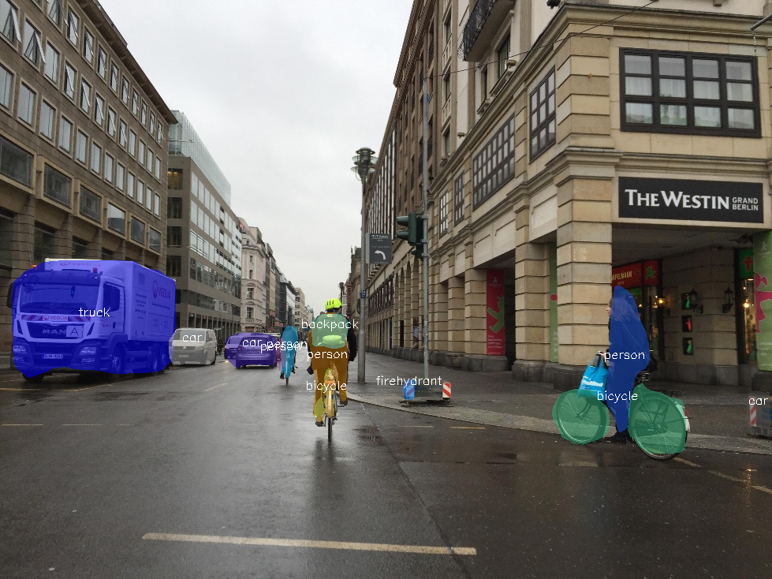

# instance-segmentation-security-1040

## Use Case and High-Level Description

This model is an instance segmentation network for 80 classes of objects.
It is a Mask R-CNN with EfficientNet-B2 backbone, light-weight FPN, RPN,
detection and segmentation heads.

## Example

## Specification

| Metric                          | Value                                     |
|---------------------------------|-------------------------------------------|
| COCO val2017 box AP             | 35.0%                                     |
| COCO val2017 mask AP            | 31.2%                                     |
| Max objects to detect           | 100                                       |
| GFlops                          | 29.334                                    |
| MParams                         | 13.5673                                   |
| Source framework                | PyTorch\*                                 |

Average Precision (AP) is defined and measured according to standard
[COCO evaluation procedure](https://cocodataset.org/#detection-eval).

## Inputs

Image, name: `image`, shape: `1, 3, 608, 608` in the format `1, C, H, W`, where:

- `C` - number of channels
- `H` - image height
- `W` - image width

The expected channel order is `BGR`

## Outputs

1. Name: `labels`, shape: `100` - Contiguous integer class ID for every
   detected object.
2. Name: `boxes`, shape: `100, 5` - Bounding boxes around every detected objects
   in (top_left_x, top_left_y, bottom_right_x, bottom_right_y) format and its
   confidence score in range [0, 1].
3. Name: `masks`, shape: `100, 28, 28` - Segmentation heatmaps for every output
   bounding box.

## Training Pipeline

The OpenVINO [Training Extensions](https://github.com/openvinotoolkit/training_extensions/blob/develop/README.md) provide a [training pipeline](https://github.com/openvinotoolkit/training_extensions/blob/develop/models/instance_segmentation/model_templates/coco-instance-segmentation/readme.md), allowing to fine-tune the model on custom dataset.

## Legal Information

[*] Other names and brands may be claimed as the property of others.
