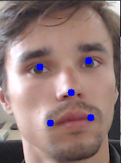

# landmarks-regression-retail-0009

## Use Case and High-Level Description

This is a lightweight landmarks regressor for the Smart Classroom scenario. It has a classic convolutional design: stacked 3x3 convolutions, batch normalizations, PReLU activations, and poolings. Final regression is done by the global depthwise pooling head and FullyConnected layers. The model predicts five facial landmarks: two eyes, nose, and two lip corners.

## Example

## Specification

| Metric                          | Value                                     |
|---------------------------------|-------------------------------------------|
| Mean Normed Error (on VGGFace2) | 0.0705                                    |
| Face location requirements      | Tight crop                                |
| GFlops                          | 0.021                                     |
| MParams                         | 0.191                                     |
| Source framework                | PyTorch\*                                 |

Normed Error (NE) for ith sample has the following form:

where N is the number of landmarks, _p_-hat and _p_ are, correspondingly, the prediction and ground truth vectors of kth landmark of ith sample, and di is the interocular distance for ith sample.

## Inputs

Image, name: `data`, shape: `1, 3, 48, 48` in the format `B, C, H, W`, where:

- `B` - batch size
- `C` - number of channels
- `H` - image height
- `W` - image width

The expected color order is `BGR`.

## Outputs

The net outputs a blob with the shape: `1, 10`, containing a row-vector of 10 floating point values
for five landmarks coordinates in the form (x0, y0, x1, y1, ..., x4, y4).
All the coordinates are normalized to be in range [0, 1].

## Legal Information
[*] Other names and brands may be claimed as the property of others.
