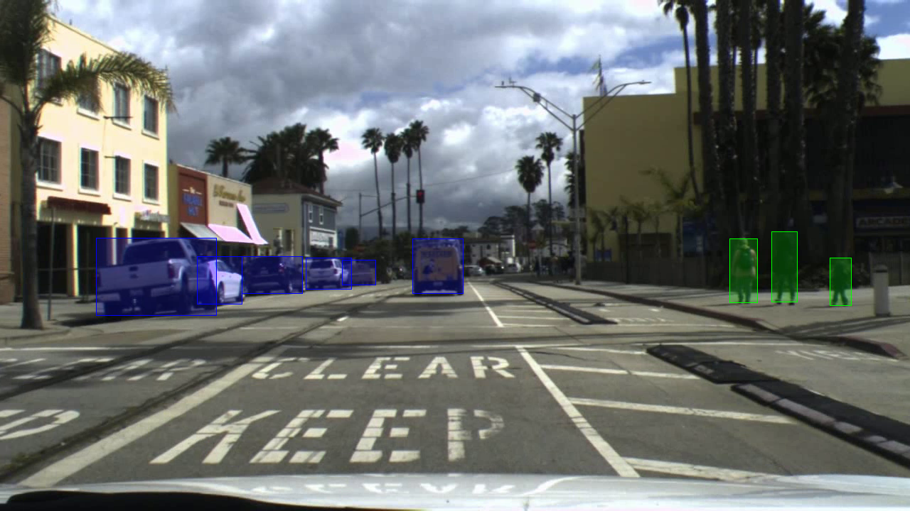

# pedestrian-and-vehicle-detector-adas-0001

## Use Case and High-Level Description

Pedestrian and vehicle detection network based on MobileNet v1.0 + SSD.

## Example

## Specification

| Metric                          | Value                 |
|---------------------------------|-----------------------|
| AP for pedestrians              | 88%                   |
| AP for vehicles                 | 90%                   |
| Target pedestrian size          | 60x120 pixels         |
| Target vehicle size             | 40x30 pixels          |
| GFLOPS                          | 3.974                 |
| MParams                         | 1.650                 |
| Source framework                | Caffe*                |

Average Precision (AP) metric is described in: Mark Everingham et al.
[The PASCAL Visual Object Classes (VOC) Challenge](http://host.robots.ox.ac.uk/pascal/VOC/pubs/everingham10.pdf).

Tested on challenging internal datasets with 1001 pedestrian and 12585 vehicles to detect.

## Performance

## Inputs

Name: `input`, shape: [1x3x384x672] - An input image in the format [BxCxHxW],
  where:
    - B - batch size
    - C - number of channels
    - H - image height
    - W - image width
  Expected color order is BGR.

## Outputs

The net outputs blob with shape: [1, 1, N, 7], where N is the number of detected
bounding boxes. Each detection has the format
  [`image_id`, `label`, `conf`, `x_min`, `y_min`, `x_max`, `y_max`], where:
  - `image_id` - ID of the image in the batch
  - `label` - predicted class ID
  - `conf` - confidence for the predicted class
  - (`x_min`, `y_min`) - coordinates of the top left bounding box corner
  - (`x_max`, `y_max`) - coordinates of the bottom right bounding box corner.

## Legal Information
[*] Other names and brands may be claimed as the property of others.
