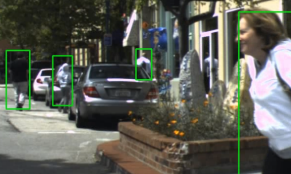

# pedestrian-detection-adas-0002

## Use Case and High-Level Description

Pedestrian detection network based on SSD framework with tuned MobileNet v1 as a feature extractor.

## Example

## Specification

| Metric                          | Value                                     |
|---------------------------------|-------------------------------------------|
| Average Precision (AP)          | 88%                                       |
| Target pedestrian size          | 60 x 120 pixels on Full HD image          |
| Max objects to detect           | 200                                       |
| GFlops                          | 2.836                                     |
| MParams                         | 1.165                                     |
| Source framework                | Caffe\*                                   |

Average Precision metric described in: Mark Everingham et al.
[The PASCAL Visual Object Classes (VOC) Challenge](https://link.springer.com/article/10.1007/s11263-009-0275-4).

Tested on an internal dataset with 1001 pedestrian to detect.

## Inputs

Image, name: `input`, shape: `1, 3, 384, 672` in the format `B, C, H, W`, where:

- `B` - batch size
- `C` - number of channels
- `H` - image height
- `W` - image width

Expected color order is `BGR`.

## Outputs

The net outputs blob with shape: `1, 1, 200, 7` in the format `1, 1, N, 7`, where `N` is the number of detected
bounding boxes. Each detection has the format [`image_id`, `label`, `conf`, `x_min`, `y_min`, `x_max`, `y_max`], where:

- `image_id` - ID of the image in the batch
- `label` - predicted class ID (1 - pedestrian)
- `conf` - confidence for the predicted class
- (`x_min`, `y_min`) - coordinates of the top left bounding box corner
- (`x_max`, `y_max`) - coordinates of the bottom right bounding box corner

## Legal Information
[*] Other names and brands may be claimed as the property of others.
