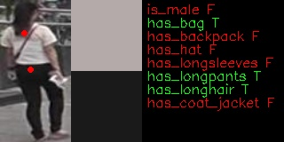
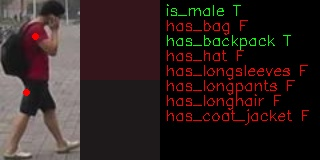

# person-attributes-recognition-crossroad-0230

## Use Case and High-Level Description

This model presents a person attributes classification algorithm analysis scenario. It produces probability of person attributions existing on the sample and a position of two point on sample, which can be used for color prob (like, color picker in graphical editors)

## Examples

## Specification

| Metric                | Value                                                                                                |
|-----------------------|------------------------------------------------------------------------------------------------------|
| Pedestrian pose       | Standing person                                                                                      |
| Occlusion coverage    | <20%                                                                                                 |
| Min object width      | 80 pixels                                                                                            |
| Supported attributes  | is_male, has_bag, has_backpack, has hat, has longsleeves, has longpants, has longhair, has coat_jacket|
| GFlops                | 0.174                                                                                                |
| MParams               | 0.735                                                                                                |
| Source framework      | PyTorch\*                                                                                            |

## Accuracy

| Attribute         |  F1   |
|-------------------|-------|
| `is_male`         | 0.91  |
| `has_bag`         | 0.66  |
| `has_backpack`    | 0.77  |
| `has_hat`         | 0.64  |
| `has_longsleeves` | 0.21  |
| `has_longpants`   | 0.83  |
| `has_longhair`    | 0.83  |
| `has_coat_jacket` |  NA   |

## Inputs

Image, name: `input`, shape: `1, 3, 160, 80` in the format `1, C, H, W`, where:

- `C` - number of channels
- `H` - image height
- `W` - image width

The expected color order is `BGR`.

## Outputs

1.  The net outputs a blob named `453` with shape: `1, 8, 1, 1` across eight attributes:
    [`is_male`, `has_bag`, `has_backpack`, `has_hat`, `has_longsleeves`, `has_longpants`, `has_longhair`,
     `has_coat_jacket`]. Value > 0.5 means that an attribute is present.
2.  The net outputs a blob named `456` with shape: `1, 2, 1, 1`. It is location of point with top color.
3.  The net outputs a blob named `459` with shape: `1, 2, 1, 1`. It is location of point with bottom color.

## Legal Information
[*] Other names and brands may be claimed as the property of others.
