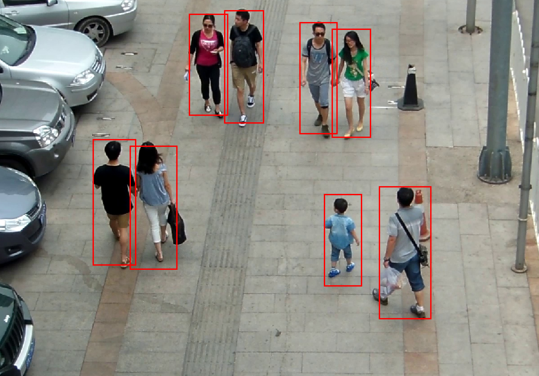

# person-detection-0106

## Use Case and High-Level Description

This is a person detector that is based on Cascade R-CNN architecture with ResNet50
backbone.

## Example

## Specification

| Metric                          | Value                                     |
|---------------------------------|-------------------------------------------|
| AP                              | 94.54% (internal test set)                |
| Pose coverage                   | Standing upright, parallel to image plane |
| Support of occluded persons     | YES                                       |
| Occlusion coverage              | <50%                                      |
| Min person height               | 100 pixels (on 1080p)                     |
| GFlops                          | 404.264                                   |
| MParams                         | 71.565                                    |
| Source framework                | PyTorch\*                                 |

Average Precision (AP) is defined as an area under
the [precision/recall](https://en.wikipedia.org/wiki/Precision_and_recall)
curve. Intersection over union threshold of 0.5 is used for matching.

## Performance

## Inputs

Name: `input`, shape: [1x3x800x1344] - An input image in the format [BxCxHxW],
where:

- B - batch size
- C - number of channels
- H - image height
- W - image width

Expected color order is BGR.

## Outputs

1. The `boxes` is a blob with the shape [N, 5], where N is the number of detected
   bounding boxes. For each detection, the description has the format
   [`x_min`, `y_min`, `x_max`, `y_max`, `conf`],
   where:
    - (`x_min`, `y_min`) - coordinates of the top left bounding box corner
    - (`x_max`, `y_max`) - coordinates of the bottom right bounding box corner
    - `conf` - confidence for the predicted class
2. The `labels` is a blob with the shape [N], where N is the number of detected
   bounding boxes. It contains `label` per each detected box.

## Legal Information
[*] Other names and brands may be claimed as the property of others.
