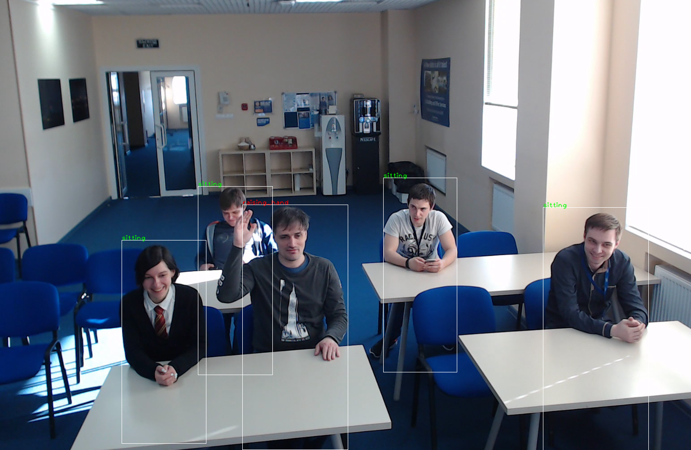

# person-detection-action-recognition-0006

## Use Case and High-Level Description

This is an action detector for the Smart Classroom scenario. It is based on the RMNet backbone that includes depth-wise convolutions to reduce the amount of computations for the 3x3 convolution block. The first SSD head from 1/8 and 1/16 scale feature maps has four clustered prior boxes and outputs detected persons (two class detector). The second SSD-based head predicts actions of the detected persons. Possible actions: sitting, writing, raising hand, standing, turned around, lie on the desk.

## Example

## Specification

| Metric                            | Value                                     |
|-----------------------------------|-------------------------------------------|
| Detector AP (internal test set 2) | 90.70%                                    |
| Accuracy (internal test set 2)    | 80.74%                                    |
| Pose coverage                     | sitting, writing, raising_hand, standing, |
|                                   | turned around, lie on the desk            |
| Support of occluded pedestrians   | YES                                       |
| Occlusion coverage                | <50%                                      |
| Min pedestrian height             | 80 pixels (on 1080p)                      |
| GFlops                            | 8.225                                     |
| MParams                           | 2.001                                     |
| Source framework                  | TensorFlow\*                              |

Average Precision (AP) is defined as an area under the [precision/recall](https://en.wikipedia.org/wiki/Precision_and_recall)
curve.

## Inputs

Image, name: `input`, shape: `1, 3, 400, 680` in the format `B, C, H, W`, where:

- `B` - batch size
- `C` - number of channels
- `H` - image height
- `W` - image width

Expected color order is `BGR`.

## Outputs

The net outputs four branches:

1. name: `ActionNet/out_detection_loc`, shape: `b, num_priors*4` - Box coordinates in SSD format
2. name: `ActionNet/out_detection_conf`, shape: `b, num_priors*2` - Detection confidences
3. name: `ActionNet/action_heads/out_head_1_anchor_1`, shape: `b, 6, 50, 86` - Action confidences
4. name: `ActionNet/action_heads/out_head_2_anchor_1`, shape: `b, 6, 25, 43` - Action confidences
5. name: `ActionNet/action_heads/out_head_2_anchor_2`, shape: `b, 6, 25, 43` - Action confidences
6. name: `ActionNet/action_heads/out_head_2_anchor_3`, shape: `b, 6, 25, 43` - Action confidences
7. name: `ActionNet/action_heads/out_head_2_anchor_4`, shape: `b, 6, 25, 43` - Action confidences

Where:

- `b` - batch size
- `num_priors` -  number of priors in SSD format (equal to 50x86x1+25x43x4=8600)

## Legal Information
[*] Other names and brands may be claimed as the property of others.
