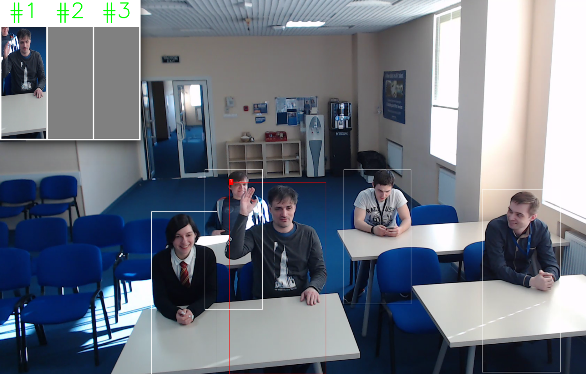

# person-detection-raisinghand-recognition-0001

## Use Case and High-Level Description

This is an action detector for the Smart Classroom scenario. It is based on the RMNet backbone that includes depth-wise convolutions to reduce the amount of computations for the 3x3 convolution block. The first SSD head from 1/16 scale feature map has four clustered prior boxes and outputs detected persons (two class detector). The second SSD-based head predicts actions of the detected persons. Possible actions: raising hand and other.

## Example

## Specification

| Metric                            | Value                                     |
|-----------------------------------|-------------------------------------------|
| Detector AP (internal test set 2) | 80.0%                                     |
| Accuracy (internal test set 2)    | 90.5%                                     |
| Pose coverage                     | Sitting, standing, raising hand           |
| Support of occluded pedestrians   | YES                                       |
| Occlusion coverage                | <50%                                      |
| Min pedestrian height             | 80 pixels (on 1080p)                      |
| GFlops                            | 7.138                                     |
| MParams                           | 1.951                                     |
| Source framework                  | Caffe\*                                   |

Average Precision (AP) is defined as an area under the [precision/recall](https://en.wikipedia.org/wiki/Precision_and_recall)
curve.

## Inputs

Image, name: `input`, shape: `1, 3, 400, 680` in the format `B, C, H, W`, where:

- `B` - batch size
- `C` - number of channels
- `H` - image height
- `W` - image width

Expected color order is `BGR`.

## Outputs

The net outputs four branches:

1. name: `mbox_loc1/out/conv/flat`, shape: `b, num_priors*4` - Box coordinates in SSD format
2. name: `mbox_main_conf/out/conv/flat/softmax/flat`, shape: `b, num_priors*2` - Detection confidences
3. name: `mbox/priorbox`, shape: `1, 2, num_priors*4` - Prior boxes in SSD format
4. name: `out/anchor1`, shape: `b, 2, h, w` - Action confidences
5. name: `out/anchor2`, shape: `b, 2, h, w` - Action confidences
6. name: `out/anchor3`, shape: `b, 2, h, w` - Action confidences
7. name: `out/anchor4`, shape: `b, 2, h, w` - Action confidences

Where:

- `b` - batch size
- `num_priors` -  number of priors in SSD format (equal to 25x43x4=4300)
- `h, w` - height and width of the output feature map (h=25, w=43)

## Legal Information
[*] Other names and brands may be claimed as the property of others.
