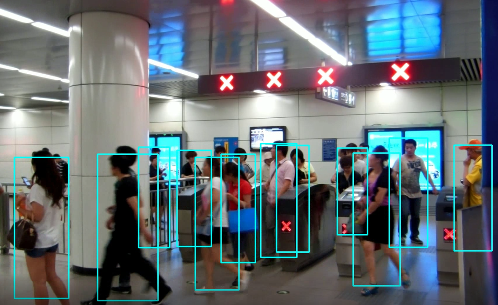

# person-detection-retail-0002 {#person-detection-retail-0002}

## Use Case and High-Level Description

This is a pedestrian detector based on backbone with hyper-feature + R-FCN for the Retail scenario.

## Example

## Specification

| Metric                          | Value                                     |
|---------------------------------|-------------------------------------------|
| AP                              | 80.14%                                    |
| Pose coverage                   | Standing upright, parallel to image plane |
| Support of occluded pedestrians | YES                                       |
| Occlusion coverage              | <50%                                      |
| Min pedestrian height           | 80 pixels (on 1080p)                      |
| Max objects to detect           | 200                                       |
| GFlops                          | 12.427                                    |
| MParams                         | 3.244                                     |
| Source framework                | Caffe*                                     |

Average Precision (AP) is defined as an area under the
[precision/recall](https://en.wikipedia.org/wiki/Precision_and_recall)
curve. Validation dataset consists of ~50K of images from ~100 different scenes.

## Performance

## Inputs

1.	name: `data` , shape: [1x3x544x992] - An input image in following format
      [1xCxHxW]. The expected channel order is BGR.

2.	name: `im_info`, shape: [1x6] - An image information
    [544, 992, 992/`frame_width`, 544/`frame_height`, 992/`frame_width`, 544/`frame_height`]

## Outputs

The net outputs blob with shape: [1, 1, N, 7], where N is the number of detected
bounding boxes. Each detection has the format
  [`image_id`, `label`, `conf`, `x_min`, `y_min`, `x_max`, `y_max`], where:
  - `image_id` - ID of the image in the batch
  - `label` - predicted class ID
  - `conf` - confidence for the predicted class
  - (`x_min`, `y_min`) - coordinates of the top left bounding box corner
  - (`x_max`, `y_max`) - coordinates of the bottom right bounding box corner.

   ## Legal Information
[*] Other names and brands may be claimed as the property of others.
