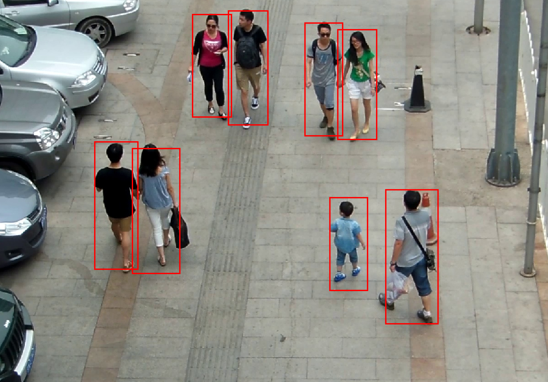

# person-detection-retail-0013

## Use Case and High-Level Description

This is a pedestrian detector for the Retail scenario. It is based on MobileNetV2-like
backbone that includes depth-wise convolutions to reduce the amount of
computation for the 3x3 convolution block. The single SSD head from 1/16 scale
feature map has 12 clustered prior boxes.

## Example

## Specification

| Metric                          | Value                                     |
|---------------------------------|-------------------------------------------|
| AP                              | 88.62%                                    |
| Pose coverage                   | Standing upright, parallel to image plane |
| Support of occluded pedestrians | YES                                       |
| Occlusion coverage              | <50%                                      |
| Min pedestrian height           | 100 pixels (on 1080p)                     |
| GFlops                          | 2.300                                     |
| MParams                         | 0.723                                     |
| Source framework                | Caffe\*                                   |

Average Precision (AP) is defined as an area under
the [precision/recall](https://en.wikipedia.org/wiki/Precision_and_recall)
curve.

## Inputs

Image, name: `input`, shape: `1, 3, 320, 544` in the format `B, C, H, W`, where:

- `B` - batch size
- `C` - number of channels
- `H` - image height
- `W` - image width

Expected color order is `BGR`.

## Outputs

The net outputs blob with shape: `1, 1, 200, 7` in the format `1, 1, N, 7`, where `N` is the number of detected
bounding boxes. Each detection has the format [`image_id`, `label`, `conf`, `x_min`, `y_min`, `x_max`, `y_max`], where:

- `image_id` - ID of the image in the batch
- `label` - predicted class ID (1 - person)
- `conf` - confidence for the predicted class
- (`x_min`, `y_min`) - coordinates of the top left bounding box corner
- (`x_max`, `y_max`) - coordinates of the bottom right bounding box corner

## Legal Information
[*] Other names and brands may be claimed as the property of others.
