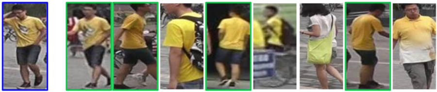

# person-reidentification-retail-0031

## Use Case and High-Level Description

This is a person reidentification model for a general scenario. It uses a whole body image as an input and outputs an embedding vector to match a pair of images by the cosine distance. The model is based on the RMNet backbone developed for fast inference. A single reidentification head from the 1/16 scale feature map outputs an embedding vector of 256 floats.

## Example

## Specification

| Metric                            | Value                                     |
|-----------------------------------|-------------------------------------------|
| Market-1501 rank@1 accuracy       | 0.7791                                    |
| Market-1501 mAP                   | 0.6180                                    |
| Pose coverage                     | Standing upright, parallel to image plane |
| Support of occluded pedestrians   | YES                                       |
| Occlusion coverage                | <50%                                      |
| GFlops                            | 0.028                                     |
| MParams                           | 0.280                                     |
| Source framework                  | Caffe*                                    |

The cumulative matching curve (CMC) at rank-1 is accuracy denoting the possibility to locate at least one true positive in the top-1 rank.
Mean Average Precision (mAP) is the mean across Average Precision (AP) of all queries. AP is defined as the area under the [precision and recall](https://en.wikipedia.org/wiki/Precision_and_recall) curve.

## Performance

## Inputs

1. Name: `data` , shape: [1x3x96x48]. An input image in the format [BxCxHxW],
   where:
    - B - batch size
    - C - number of channels
    - H - image height
    - W - image width

   The expected color order is BGR.

## Outputs

1. The net outputs a blob with the [1, 256, 1, 1] shape named `descriptor`, which can be compared with other descriptors using the [cosine distance](https://en.wikipedia.org/wiki/Cosine_similarity).

## Legal Information
[*] Other names and brands may be claimed as the property of others.
