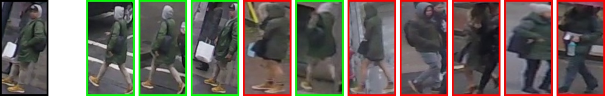

# person-reidentification-retail-0107

## Use Case and High-Level Description

This is a person reidentification model for a general scenario. It uses a whole 
body image as an input and outputs an embedding vector to match a pair of images 
by the Cosine distance. The model is based on OmniScaleNet backbone that was 
developed for fast inference. A single reidentification head from the 1/16 scale 
feature map outputs the embedding vector of 256 floats.

## Example

## Specification

| Metric                            | Value                                     |
|-----------------------------------|-------------------------------------------|
| GlobalMe-reID rank@1 accuracy     | 91.7                                      |
| GlobalMe-reID mAP                 | 63.4                                      |
| Pose coverage                     | Standing upright, parallel to image plane |
| Support of occluded pedestrians   | YES                                       |
| Occlusion coverage                | <50%                                      |
| GFlops                            | 0.174                                     |
| MParams                           | 0.183                                     |
| Source framework                  | Pytorch*                                  |

The cumulative matching curve (CMC) at rank-1 is accuracy denoting the possibility 
to locate at least one true positive in the top-1 rank.
Mean Average Precision (mAP) is the mean across all queries' Average Precision (AP) 
and AP is defined as an area under the 
[precision/recall](https://en.wikipedia.org/wiki/Precision_and_recall) curve.

## Performance

## Inputs

1. name: "data" , shape: [1x3x256x128] - An input image in the format [BxCxHxW],
   where:
    - B - batch size
    - C - number of channels
    - H - image height
    - W - image width

   The expected color order is BGR.

## Outputs

1. The net outputs a blob with shape: [1, 256] named descriptor, which can be 
compared with other descriptors using the 
[Cosine distance](https://en.wikipedia.org/wiki/Cosine_similarity).

## Legal Information
[*] Other names and brands may be claimed as the property of others.
