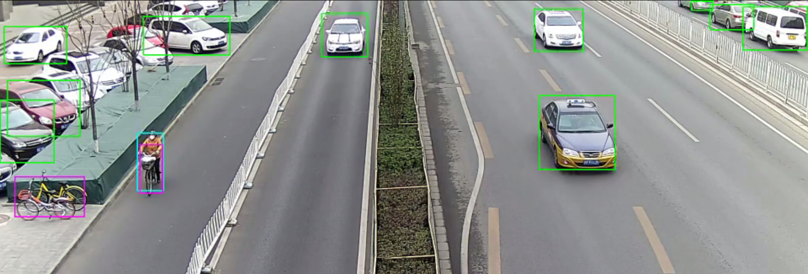

# person-vehicle-bike-detection-crossroad-0078

## Use Case and High-Level Description

Person/Vehicle/Bike detector is based on SSD detection architecture, RMNet backbone, and learnable image downscale block (like person-vehicle-bike-detection-crossroad-0066, but with extra pooling).
The model is intended for security surveillance applications and works in a variety of scenes and weather/lighting
conditions.

## Example

## Specification

| Metric                          | Value                                     |
|---------------------------------|-------------------------------------------|
| Mean Average Precision (mAP)    | 65.12%                                    |
| AP people                       | 77.47%                                    |
| AP vehicles                     | 74.94%                                    |
| AP bikes                        | 44.14%                                    |
| Max objects to detect           | 200                                       |
| GFlops                          | 3.964                                     |
| MParams                         | 1.178                                     |
| Source framework                | Caffe\*                                   |

Average Precision (AP) is defined as an area under the
[precision/recall](https://en.wikipedia.org/wiki/Precision_and_recall)
curve.

Validation dataset consists of 34,757 images from various scenes and includes:

| Type of object | Number of bounding boxes |
|----------------|--------------------------|
| Vehicle        | 229,503                  |
| Pedestrian     | 240,009                  |
| Bike           | 62,643                   |

Similarly, training dataset has 160,297 images with:

| Type of object | Number of bounding boxes |
|----------------|--------------------------|
| Vehicle        | 501,548                  |
| Pedestrian     | 706,786                  |
| Bike           | 55,692                   |

## Inputs

Image, name: `input`, shape: `1, 3, 1024, 1024` in the format `B, C, H, W`, where:

- `B` - batch size
- `C` - number of channels
- `H` - image height
- `W` - image width

The expected color order is `BGR`.

## Outputs

The net outputs blob with shape: `1, 1, 200, 7` in the format `1, 1, N, 7`, where `N` is the number of detected
bounding boxes. Each detection has the format [`image_id`, `label`, `conf`, `x_min`, `y_min`, `x_max`, `y_max`], where:

- `image_id` - ID of the image in the batch
- `label` - predicted class ID (1- person, 2 - vehicle, 3 - bike)
- `conf` - confidence for the predicted class
- (`x_min`, `y_min`) - coordinates of the top left bounding box corner
- (`x_max`, `y_max`) - coordinates of the bottom right bounding box corner

## Legal Information
[*] Other names and brands may be claimed as the property of others.
