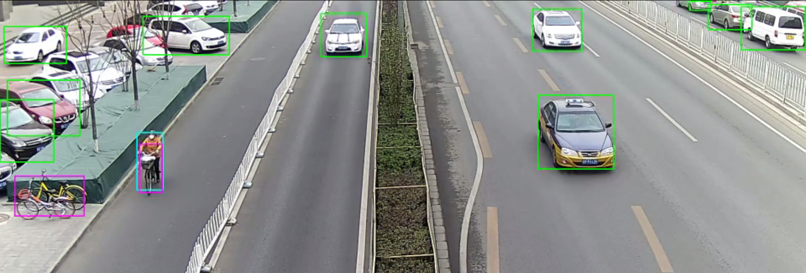

# person-vehicle-bike-detection-crossroad-yolov3-1020

## Use Case and High-Level Description

This is a YOLO V3 network fine-tuned for Person/Vehicle/Bike detection for security
surveillance applications. It works in a variety of scenes and weather/lighting
conditions.

Yolo V3 is a real-time object detection model implemented with Keras\*
from this [repository](https://github.com/david8862/keras-YOLOv3-model-set)
and converted to TensorFlow\* framework.

This model was pre-trained on [Common Objects in Context (COCO)](https://cocodataset.org/#home) dataset with 80 classes and then fine-tuned for
Person/Vehicle/Bike detection.

## Example

## Specification

| Metric                          | Value       |
|---------------------------------|-------------|
| Mean Average Precision (mAP)    | 48.89%      |
| AP people                       | 58.94%      |
| AP vehicles                     | 62.05%      |
| AP bikes/motorcycles            | 25.66%      |
| GFlops                          | 65.98       |
| MParams                         | 61.92       |
| Source framework                | Keras\*     |

Average Precision (AP) is defined as an area under the
[precision/recall](https://en.wikipedia.org/wiki/Precision_and_recall)
curve.

Validation dataset consists of 34757 images from various scenes and includes:

| Type of object  | Number of bounding boxes |
|-----------------|--------------------------|
| Vehicle         | 229503                   |
| Pedestrian      | 240009                   |
| Bike/Motorcycle | 62643                    |

Similarly, training dataset has 17084 images with:

| Type of object  | Number of bounding boxes |
|-----------------|--------------------------|
| Vehicle         | 121111                   |
| Pedestrian      | 119546                   |
| Bike/Motorcycle | 30220                    |

## Inputs

Image, name: `image_input`, shape: `1, 3, 416, 416` in the format `B, C, H, W`, where:

- `B` - batch size
- `C` - number of channels
- `H` - image height
- `W` - image width

Expected color order: `BGR`.

## Outputs

1. The array of detection summary info, name: `conv2d_58/Conv2D/YoloRegion`,  shape: `1, 255, 13, 13`. The anchor values are `116,90,  156,198,  373,326`.

2. The array of detection summary info, name: `conv2d_66/Conv2D/YoloRegion`,  shape: `1, 255, 26, 26`. The anchor values are `30,61,  62,45,  59,119`.

3. The array of detection summary info, name: `conv2d_74/Conv2D/YoloRegion`,  shape: `1, 255, 52, 52`. The anchor values are `10,13,  16,30,  33,23`.

For each of the arrays the output format is `B, N*85, Cx, Cy`, where:

- `B` - batch size
- `N` - number of detection boxes for cell
- `Cx`, `Cy` - cell index

Detection box has format [`x`, `y`, `h`, `w`, `box_score`, `class_no_1`, ..., `class_no_80`], where:

- (`x`, `y`) - coordinates of box center relative to the cell
- `h`, `w` - raw height and width of box, apply [exponential function](https://en.wikipedia.org/wiki/Exponential_function)
    and multiply them by the corresponding anchors to get the absolute height and width values
- `box_score` - confidence of detection box in [0, 1] range
- `class_no_1`, ..., `class_no_80` - probability distribution over the classes in the [0, 1] range,
    multiply them by the confidence value `box_score` to get confidence of each class

Since the model is finetuned on person/vehicle/bike detection dataset, it returns non-zero scores for the following classes:
* person - the first class score
* non-vehicle (bike/motorcycle) - the second class score
* vehicle - the third class score
Note that the indexes of these 3 classes are aligned with the indexes of the classes `person`, `bike`, and `car` in the
original [Common Objects in Context (COCO)](https://cocodataset.org/#home) dataset.
Also note that the model returns class scores for all 80 COCO classes for backward compatibility with the original Yolo V3.

## Legal information
[\*] Other names and brands may be claimed as the property of others.
