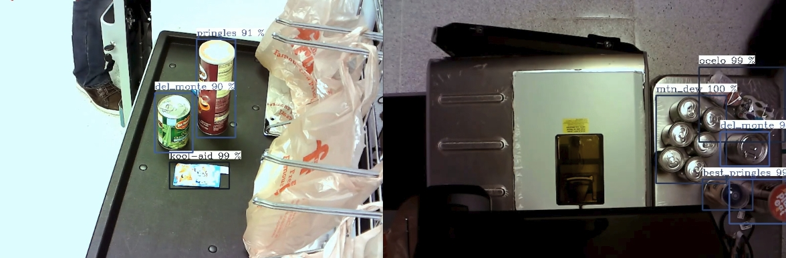

# product-detection-0001

## Use Case and High-Level Description

A product detector based on the SSD-lite architecture with [MobileNetV2](https://arxiv.org/abs/1801.04381) as a backbone for self-checkout points of sale-related scenes.
The network can detect 12 classes of objects (`sprite`, `kool-aid`, `extra`, `ocelo`, `finish`, `mtn_dew`, `best_foods`, `gatorade`, `heinz`, `ruffles`, `pringles`, `del_monte`). Labels 0 and 1 are related to `background_label` and `undefined` correspondingly.

## Example

## Specification

| Metric                                                            | Value     |
|-------------------------------------------------------------------|-----------|
| Average Precision (AP) @[ IoU=0.50:0.95,  area=all, maxDets=100 ] | 0.715     |
| GFlops                                                            | 3.598     |
| MParams                                                           | 3.212     |
| Source framework                                                  | PyTorch\* |

## Inputs

Image, name: `input`, shape: `1, 3, 512, 512` in the format `B, C, H, W`, where:

- `B` - batch size
- `C` - number of channels
- `H` - image height
- `W` - image width

Expected color order: `BGR`.

## Outputs

The net outputs a blob with shape: `1, 1, 200, 7` in the format `1, 1, N, 7`, where `N` is the number of detected
bounding boxes. For each detection, the description has the [`image_id`, `label`, `conf`, `x_min`, `y_min`, `x_max`, `y_max`] format, where:

- `image_id` - ID of the image in the batch
- `label` - predicted class ID
- `conf` - confidence for the predicted class
- (`x_min`, `y_min`) - coordinates of the top left bounding box corner
- (`x_max`, `y_max`) - coordinates of the bottom right bounding box corner

## Legal Information
[*] Other names and brands may be claimed as the property of others.
