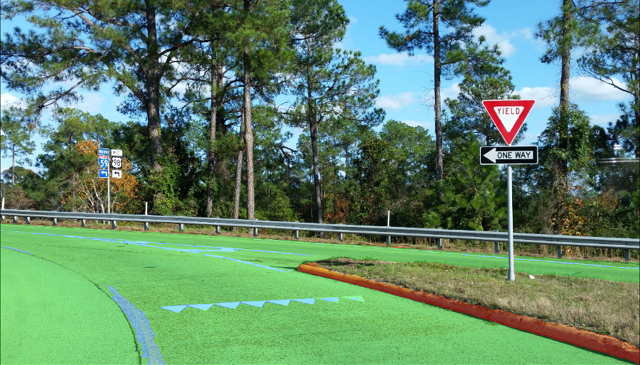

# road-segmentation-adas-0001

## Use Case and High-Level Description

This is a segmentation network to classify each pixel into four classes: BG, road, curb, mark.

## Example

## Specification
| Metric          | Value    |
|-----------------|----------|
| Image size      | 896x512  |
| GFlops          | 4.770    |
| MParams         | 0.184    |
| Source framework| PyTorch* |

## Accuracy

The quality metrics calculated on 500 images from "Mighty AI" dataset
that was converted for four class classification task are:

| Label    |       IOU |       ACC |
|----------|-----------|-----------|
| **mean** | **0.844** | **0.901** |
| BG       |     0.986 |     0.994 |
| road     |     0.954 |     0.974 |
| curbs    |     0.727 |     0.831 |
| marks    |     0.708 |     0.806 |

- `IOU=TP/(TP+FN+FP)`
- `ACC=TP/GT`
- `TP` - number of true positive pixels for given class
- `FN` - number of false negative pixels for given class
- `FP` - number of false positive pixels for given class
- `GT` - number of ground truth pixels for given class

## Inputs

A blob with a BGR image in the format: [B, C=3, H=512, W=896], where:

- B – batch size
- C – number of channels
- H – image height
- W – image width

## Outputs

The output is a blob with the shape [B, C=4, H=512, W=896]. It can be treated as a four-channel feature map, where each channel is a probability of one of the classes: BG, road, curb, mark.

## Legal Information
[*] Other names and brands may be claimed as the property of others.
