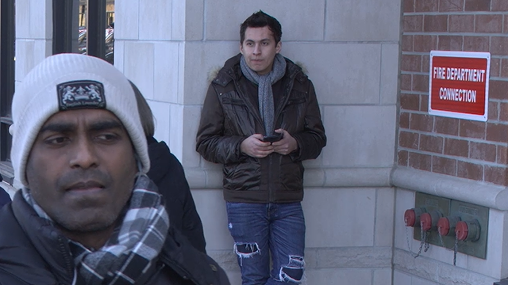

# single-image-super-resolution-1033

## Use Case and High-Level Description

[An Attention-Based Approach for Single Image Super Resolution](https://arxiv.org/abs/1807.06779) but with reduced number of
channels and changes in network architecture. It enhances the resolution of the input image by a factor of 3.

## Example

Low resolution:

Bicubic interpolation:

Super resolution:

## Specification

| Metric                          | Value                                     |
|---------------------------------|-------------------------------------------|
| PSNR                            | 30.97 dB                                  |
| GFlops                          | 16.062                                    |
| MParams                         | 0.030                                     |
| Source framework                | PyTorch\*                                 |

For reference, PSNR for bicubic upsampling on test dataset is 28.48 dB.

## Inputs

1. Image, name: `0`, shape: `1, 3, 360, 640` in the format `B, C, H, W`, where:

    - `B` - batch size
    - `C` - number of channels
    - `H` - image height
    - `W` - image width

2. Bicubic interpolation of the input image, name: `1`, shape: `1, 3, 1080, 1920` in the format `B, C, H, W`, where:

    - `B` - batch size
    - `C` - number of channels
    - `H` - image height
    - `W` - image width

  Expected color order is `BGR`.

## Outputs

The net output is a blob with shapes `1, 3, 1080, 1920` that contains image after super resolution.

## Legal Information
[*] Other names and brands may be claimed as the property of others.
