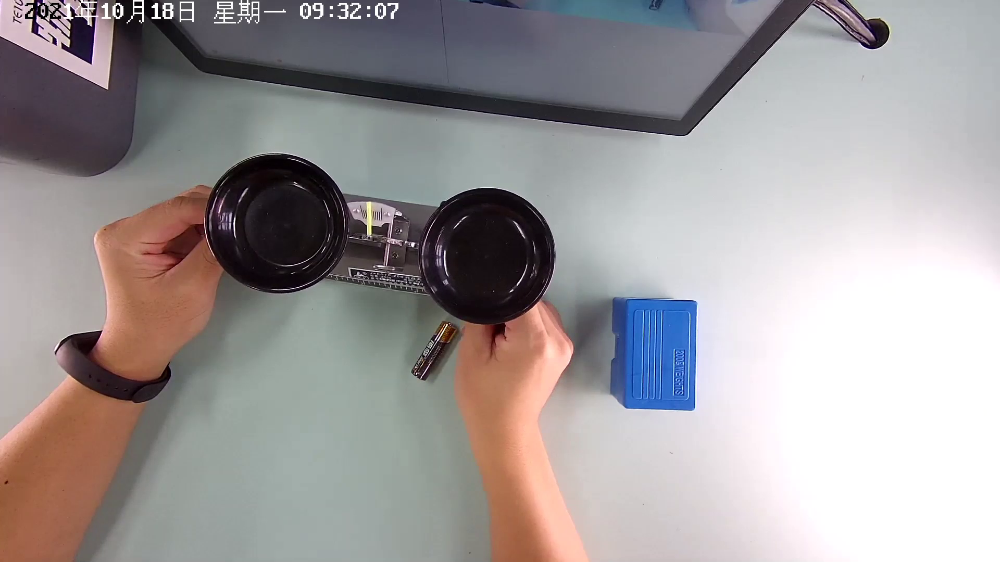

# smartlab-object-detection-0002

## Use Case and High-Level Description

This is a smartlab object detector that is based on YoloX-nano for 416x416 resolution.

## Example

## Specification

Accuracy metrics obtained on Smartlab validation dataset with yolox adapter for converted model.

| Metric                          | Value                                     |
| [COCO mAP (0.5:0.05:0.95)]      | 6.06%                                     |
| GFlops                          | 1.073                                     |
| MParams                         | 0.8894                                    |
| Source framework                | PyTorch\*                                 |

## Inputs

Image, name: `images`, shape: `1, 3, 416, 416` in the format `B, C, H, W`, where:

- `B` - batch size
- `C` - number of channels
- `H` - image height
- `W` - image width

Expected color order is `BGR`.

## Outputs

The array of detection summary info, name - `output`, shape - `1, 3549, 8`, format is `B, N, 8`, where:

- `B` - batch size
- `N` - number of detection boxes

Detection box has format [`x`, `y`, `h`, `w`, `box_score`, `class_no_1`, ...,`class_no_3`], where:

- (`x`, `y`) - raw coordinates of box center
- `h`, `w` - raw height and width of box
- `box_score` - confidence of detection box
- `class_no_1`, ..., `class_no_3` - probability distribution over the classes in logits format.

## Legal Information

[*] Other names and brands may be claimed as the property of others.
