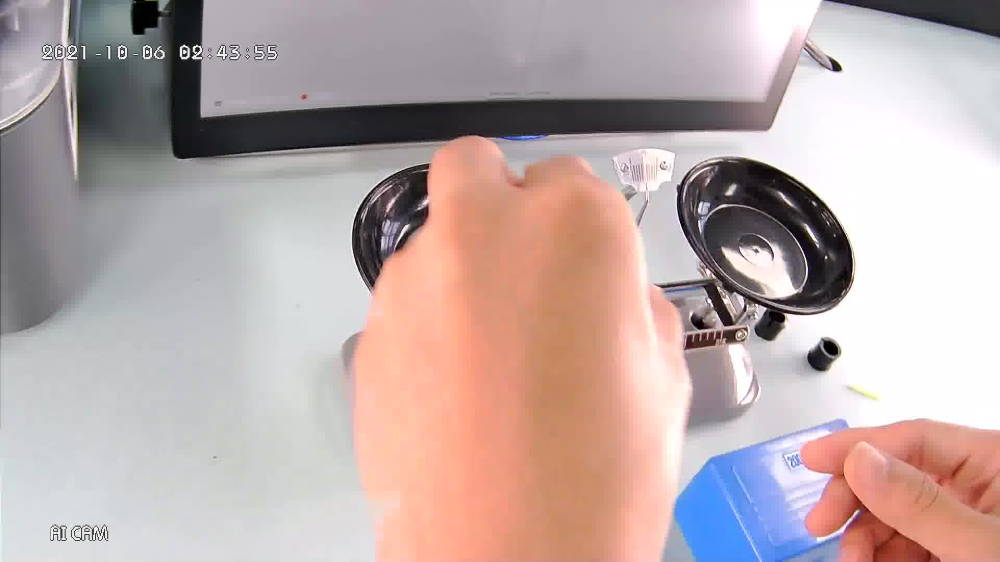

# smartlab-object-detection-0003

## Use Case and High-Level Description

This is a smartlab object detector that is based on YoloX for 416x416 resolution.

## Example

## Specification

Accuracy metrics obtained on Smartlab validation dataset with yolox adapter for converted model.

| Metric                          | Value                                     |
|---------------------------------|-------------------------------------------|
| [COCO mAP (0.5:0.05:0.95)]      | 37.12%                                    |
| GFlops                          | 1.077                                     |
| MParams                         | 0.8908                                    |
| Source framework                | PyTorch\*                                 |

## Inputs

Image, name: `images`, shape: `1, 1, 416, 416` in the format `B, C, H, W`, where:

- `B` - batch size
- `C` - number of channels
- `H` - image height
- `W` - image width

Expected color order is `BGR`.

## Outputs

The net outputs blob with shape: `1, 1, 200, 7` in the format `1, 1, N, 7`, where `N` is the number of detected
bounding boxes. Each detection has the format [`x_min`, `y_min`, `x_max`, `y_max`, `conf1`, `conf2`, `label`], where:

- (`x_min`, `y_min`) - coordinates of the top left bounding box corner
- (`x_max`, `y_max`) - coordinates of the bottom right bounding box corner
- `conf1` - confidence for the predicted class global?
- `conf2` - confidence for the predicted class local?
- `label` - predicted class ID (0 - balance, 1 - weights, 2 - tweezers, 3 - box, 4 - battery, 5 - tray, 6 - ruler, 7 - rider, 8 - scale, 9 - hand)

## Legal Information

[*] Other names and brands may be claimed as the property of others.
