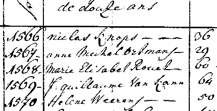

# text-image-super-resolution-0001

## Use Case and High-Level Description

A tiny model to upscale scanned images with text. The model used the `ConvTranspose2d` layer instead
of the `PixelShuffle` layer. As a result, the model can be launched on GPU and MYRIAD devices and
support the `reshape` function.

## Example

### Low Resolution

### Bicubic Interpolation

### Super Resolution

## Specification

| Metric                          | Value                                     |
|---------------------------------|-------------------------------------------|
| PSNR                            | 21.64 dB                                  |
| GFlops                          | 1.379                                     |
| MParams                         | 0.003                                     |
| Source framework                | PyTorch\*                                 |

## Inputs

Image, name: `0`, shape: `1, 1, 360, 640` in the format `B, C, H, W`, where:

- `B` - batch size
- `C` - number of channels
- `H` - image height
- `W` - image width

## Outputs

One blob with shapes `1, 1, 1080, 1920`. The blob contains an image after super resolution.

## Legal Information
[*] Other names and brands may be claimed as the property of others.
