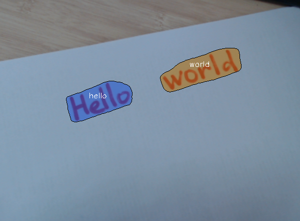

# text-spotting-0001-recognizer-encoder

## Use case and High-level description

This is text spotting model that means it simultaneously detects and
recognizes text. The model detects symbol sequences separated by space and does
recognition without using any dictionary. The model is built on top of Mask-RCNN
framework with additional attention-based text recognition head.

Symbols set is alphanumeric: 0123456789abcdefghijklmnopqrstuvwxyz

This model is fully-convolutional encoder of text recognition head.

## Example

## Specification

| Metric                                        | Value     |
|-----------------------------------------------|-----------|
| Word spotting hmean ICDAR2015, w/o dictionary | 59.04%    |
| GFlops                                        | 2.082     |
| MParams                                       | 1.328     |
| Source framework                              | PyTorch\* |

*Hmean Word spotting* is defined and measured according to
[Incidental Scene Text (ICDAR2015) challenge](https://rrc.cvc.uab.es/?ch=4&com=introduction).

## Performance

## Inputs

name: `input` , shape: [1x64x28x28] - Text recognition features obtained from detection part.

## Outputs

name: `output`, shape: [1x256x64x64] - Encoded text recognition features.

## Legal Information
[*] Other names and brands may be claimed as the property of others.
