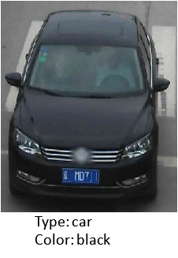

# vehicle-attributes-recognition-barrier-0039

## Use Case and High-Level Description

This model presents a vehicle attributes classification algorithm for a traffic analysis scenario.

## Example

## Specification

| Metric                | Value                                        |
|-----------------------|----------------------------------------------|
| Car pose              | Front facing cars                            |
| Occlusion coverage    | <50%                                         |
| Min object width      | 72 pixels                                    |
| Supported colors      | White, gray, yellow, red, green, blue, black |
| Supported types       | Car, bus, truck, van                         |
| GFlops                | 0.126                                        |
| MParams               | 0.626                                        |
| Source framework      | Caffe\*                                      |

## Accuracy - Confusion Matrix

### Color accuracy, %

|           | blue     | gray     | yellow   | green    | black    | white    | red      |
|-----------|:--------:|:--------:|:--------:|:--------:|:--------:|:--------:|:--------:|
|**blue**   |**79.53** | 4.32     | 0.62     | 6.41     | 6.54     | 2.47     | 0.12     |
|**gray**   | 2.53     |**78.01** | 0        | 1.36     | 1.18     | 16.74    | 0.18     |
|**yellow** | 0        | 13.9     |**54.01** | 11.21    | 0        | 10.7     | 10.16    |
|**green**  | 3.79     | 1.52     | 1.52     |**83.33** | 6.06     | 3.03     | 0.76     |
|**black**  | 0.85     | 1.92     | 0        | 0.32     |**96.1**  | 0.74     | 0.07     |
|**white**  | 1.45     | 10.86    | 0.17     | 2.53     | 0.08     |**84.83** | 0.08     |
|**red**    | 0.89     | 0.3      | 2.18     | 2.18     | 0.3      | 1.88     |**92.27** |

**Color average accuracy: 81.15 %**

### Type accuracy, %

|          | car     | van     | truck   | bus     |
|----------|:-------:|:-------:|:-------:|:-------:|
|**car**   |**98.26**| 0.56    | 0.98    | 0.2     |
|**van**   | 3.72    |**89.16**| 6.15    | 0.97    |
|**track** | 1.71    | 2.46    |**94.27**| 1.56    |
|**bus**   | 7.94    | 3.8     | 19.69   |**68.57**|

**Type average accuracy: 87.56 %**

## Performance (FPS)

## Inputs

1.	name: `input` , shape: [1x3x72x72] - An input image in following format
[1xCxHxW], where:

    - C - number of channels
    - H - image height
    - W - image width

Expected color order: BGR.

## Outputs

1.	name: "color", shape: [1, 7, 1, 1] - Softmax output across seven color classes
    [white, gray, yellow, red, green, blue, black]
2.	name: "type", shape: [1, 4, 1, 1] - Softmax output across four type classes
    [car, bus, truck, van]

## Legal Information
[\*] Other names and brands may be claimed as the property of others.
