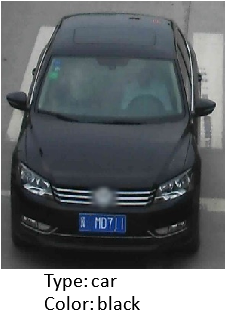

# vehicle-attributes-recognition-barrier-0042

## Use Case and High-Level Description

This model presents a vehicle attributes classification algorithm for a traffic analysis scenario.

## Example

## Specification

| Metric                | Value                                        |
|-----------------------|----------------------------------------------|
| Car pose              | Front facing cars                            |
| Occlusion coverage    | <50%                                         |
| Min object width      | 72 pixels                                    |
| Supported colors      | White, gray, yellow, red, green, blue, black |
| Supported types       | Car, van, truck, bus                         |
| GFlops                | 0.462                                        |
| MParams               | 11.177                                       |
| Source framework      | PyTorch\*                                    |

## Accuracy

### Color accuracy, %

| Color    | Accuracy   |
|:--------:|:----------:|
| white    | 84.20%     |
| gray     | 77.47%     |
| yellow   | 61.50%     |
| red      | 94.65%     |
| green    | 81.82%     |
| blue     | 82.49%     |
| black    | 96.84%     |

**Color average accuracy: 82.71%**

### Type accuracy, %

| Type  | Accuracy |
|:-----:|:--------:|
| car   | 97.44%   |
| van   | 86.41%   |
| truck | 96.95%   |
| bus   | 68.57%   |

**Type average accuracy: 87.34%**

## Inputs

Image, name: `input`, shape: `1, 3, 72, 72` in format `1, C, H, W`, where:

- `C` - number of channels
- `H` - image height
- `W` - image width

Expected color order: `BGR`.

## Outputs

1.	Name: `color`, shape: `1, 7` - probabilities across seven color classes
    [`white`, `gray`, `yellow`, `red`, `green`, `blue`, `black`]
2.	Name: `type`, shape: `1, 4` - probabilities across four type classes
    [`car`, `van`, `truck`, `bus`]

## Legal Information
[\*] Other names and brands may be claimed as the property of others.
