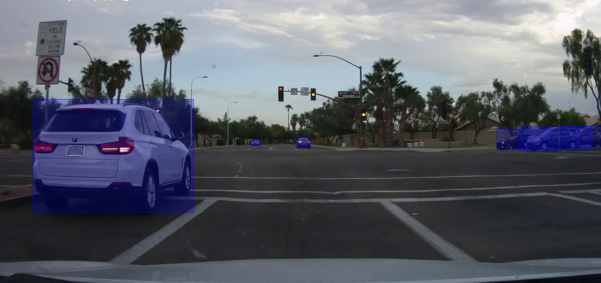

# vehicle-detection-0201

## Use Case and High-Level Description

This is a vehicle detector that is based on MobileNetV2
backbone with two SSD heads from 1/16 and 1/8 scale feature maps and clustered
prior boxes for 384x384 resolution.

## Example

## Specification

| Metric                          | Value                                     |
|---------------------------------|-------------------------------------------|
| AP @ [ IoU=0.50:0.95 ]          | 0.323 (internal test set)                 |
| GFlops                          | 1.768                                     |
| MParams                         | 1.817                                     |
| Source framework                | PyTorch\*                                 |

Average Precision (AP) is defined as an area under
the [precision/recall](https://en.wikipedia.org/wiki/Precision_and_recall)
curve.

## Inputs

Image, name: `input`, shape: `1, 3, 384, 384` in the format `B, C, H, W`, where:

- `B` - batch size
- `C` - number of channels
- `H` - image height
- `W` - image width

Expected color order is `BGR`.

## Outputs

The net outputs blob with shape: `1, 1, 200, 7` in the format `1, 1, N, 7`, where `N` is the number of detected
bounding boxes. Each detection has the format [`image_id`, `label`, `conf`, `x_min`, `y_min`, `x_max`, `y_max`], where:

- `image_id` - ID of the image in the batch
- `label` - predicted class ID (0 - vehicle)
- `conf` - confidence for the predicted class
- (`x_min`, `y_min`) - coordinates of the top left bounding box corner
- (`x_max`, `y_max`) - coordinates of the bottom right bounding box corner

## Legal Information
[*] Other names and brands may be claimed as the property of others.
