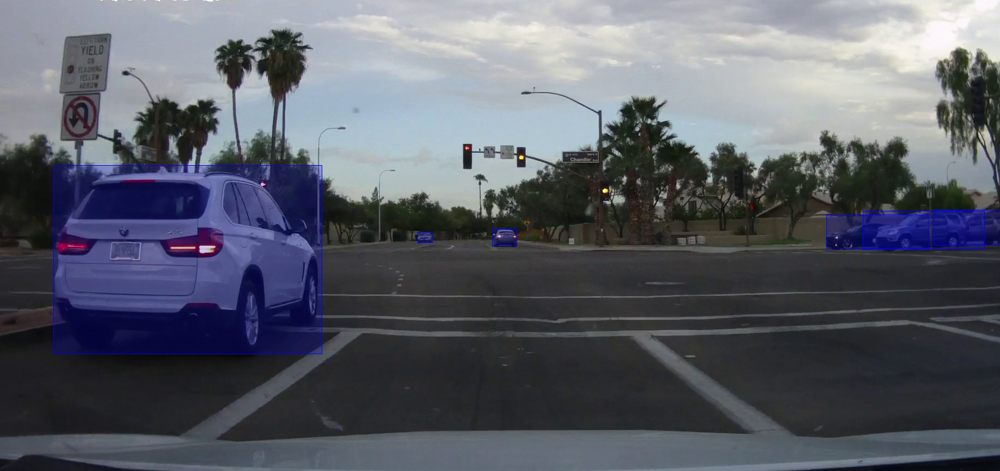

# vehicle-detection-adas-binary-0001

## Use Case and High-Level Description

This is a vehicle detection network based on an SSD framework with tuned MobileNet v1 as a feature extractor and using binary layer for speedup.
This detecector was created by binarization the vehicle-detection-adas-0002

## Example

## Specification

| Metric                          | Value                                     |
|---------------------------------|-------------------------------------------|
| Average Precision (AP)          | 89.2%                                     |
| Target vehicle size             | 40 x 30 pixels on Full HD image           |
| Max objects to detect           | 200                                       |
| GFlops                          | 0.75                                      |
| GI1ops                          | 2.048                                     |
| MParams                         | 1.079                                     |
| Source framework                | PyTorch*                                  |

For Average Precision metric description, see [The PASCAL Visual Object Classes (VOC) Challenge](http://host.robots.ox.ac.uk/pascal/VOC/pubs/everingham10.pdf).

Tested on a challenging internal dataset with 3000 images and 12585 vehicles to detect.

## Performance

## Inputs

Name: `input`, shape: [1x3x384x672] - An input image in the format [BxCxHxW],
  where:
    - B - batch size
    - C - number of channels
    - H - image height
    - W - image width
  Expected color order is BGR.

## Outputs

The net outputs blob with shape: [1, 1, N, 7], where N is the number of detected
bounding boxes. Each detection has the format
  [`image_id`, `label`, `conf`, `x_min`, `y_min`, `x_max`, `y_max`], where:
  - `image_id` - ID of the image in the batch
  - `label` - predicted class ID
  - `conf` - confidence for the predicted class
  - (`x_min`, `y_min`) - coordinates of the top left bounding box corner
  - (`x_max`, `y_max`) - coordinates of the bottom right bounding box corner.

## Legal Information
[*] Other names and brands may be claimed as the property of others.

The binary network was tuned from vehicle-detection-adas-0002 model
