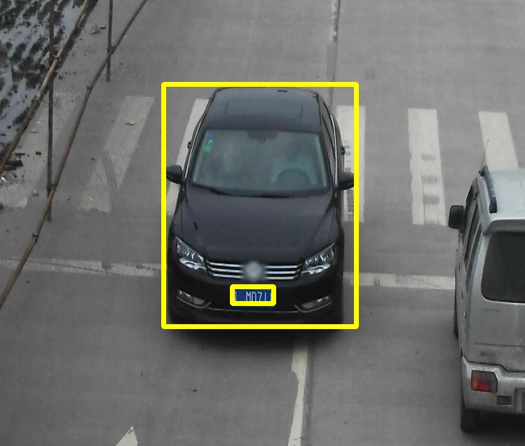

# vehicle-license-plate-detection-barrier-0106

## Use Case and High-level Description

This is a MobileNetV2 + SSD-based vehicle and (Chinese) license plate detector for
the "Barrier" use case.

## Example

## Specification

| Metric                          | Value                                      |
|---------------------------------|--------------------------------------------|
| Mean Average Precision (mAP)    | 99.65%                                     |
| AP vehicles                     | 99.88%                                     |
| AP plates                       | 99.42%                                     |
| Car pose                        | Front facing cars                          |
| Min plate width                 | 96 pixels                                  |
| Max objects to detect           | 200                                        |
| GFlops                          | 0.349                                      |
| MParams                         | 0.634                                      |
| Source framework                | TensorFlow\*                               |

Average Precision (AP) is defined as an area under the
[precision/recall](https://en.wikipedia.org/wiki/Precision_and_recall)
curve. Validation dataset is BIT-Vehicle.

## Inputs

Image, name: `input`, shape: `1, 3, 300, 300` in the format `B, C, H, W`, where:

- `B` - batch size
- `C` - number of channels
- `H` - image height
- `W` - image width

Expected color order is `BGR`.

## Outputs

The net outputs blob with shape: `1, 1, 200, 7` in the format `1, 1, N, 7`, where `N` is the number of detected
bounding boxes. Each detection has the format [`image_id`, `label`, `conf`, `x_min`, `y_min`, `x_max`, `y_max`], where:

- `image_id` - ID of the image in the batch
- `label` - predicted class ID (1 - vehicle, 2 - license plate)
- `conf` - confidence for the predicted class
- (`x_min`, `y_min`) - coordinates of the top left bounding box corner
- (`x_max`, `y_max`) - coordinates of the bottom right bounding box corner

## Legal Information
[*] Other names and brands may be claimed as the property of others.
