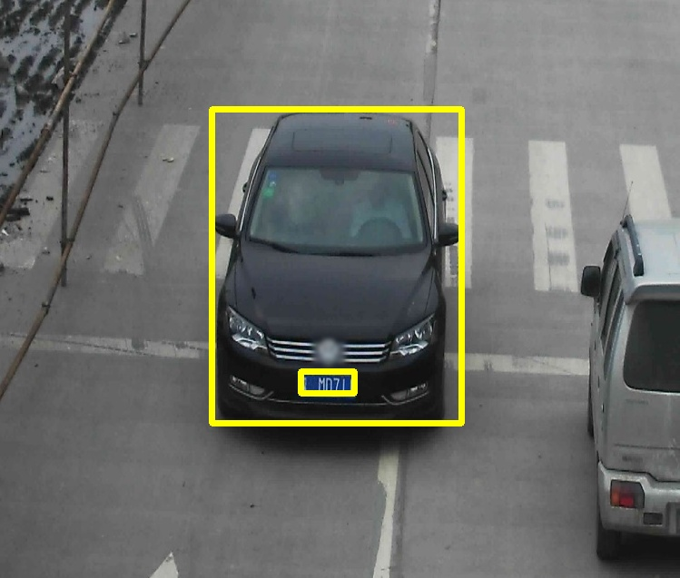

# vehicle-license-plate-detection-barrier-0106

## Use Case and High-level Description

This is a MobileNetV2 + SSD-based vehicle and (Chinese) license plate detector for
the "Barrier" use case.

## Example

## Specification

| Metric                          | Value                                      |
|---------------------------------|--------------------------------------------|
| Mean Average Precision (mAP)    | 99.65%                                     |
| AP vehicles                     | 99.88%                                     |
| AP plates                       | 99.42%                                     |
| Car pose                        | Front facing cars                          |
| Min plate width                 | 96 pixels                                  |
| Max objects to detect           | 200                                        |
| GFlops                          | 0.349                                      |
| MParams                         | 0.634                                      |
| Source framework                | TensorFlow*                                |

Average Precision (AP) is defined as an area under the
[precision/recall](https://en.wikipedia.org/wiki/Precision_and_recall)
curve. Validation dataset is BIT-Vehicle.

## Performance

## Inputs

Name: `input`, shape: [1x3x300x300] - An input image in the format [BxCxHxW],
   where:
    - B - batch size
    - C - number of channels
    - H - image height
    - W - image width

   Expected color order is BGR.

## Outputs

1. The net outputs a blob with the shape: [1, 1, N, 7], where N is the number of detected
   bounding boxes. For each detection, the description has the format:
   [`image_id`, `label`, `conf`, `x_min`, `y_min`, `x_max`, `y_max`]
    - `image_id` - ID of the image in the batch
    - `label` - predicted class ID
    - `conf` - confidence for the predicted class
    - (`x_min`, `y_min`) - coordinates of the top left bounding box corner
    - (`x_max`, `y_max`) - coordinates of the bottom right bounding box corner.

## Legal Information
[*] Other names and brands may be claimed as the property of others.
