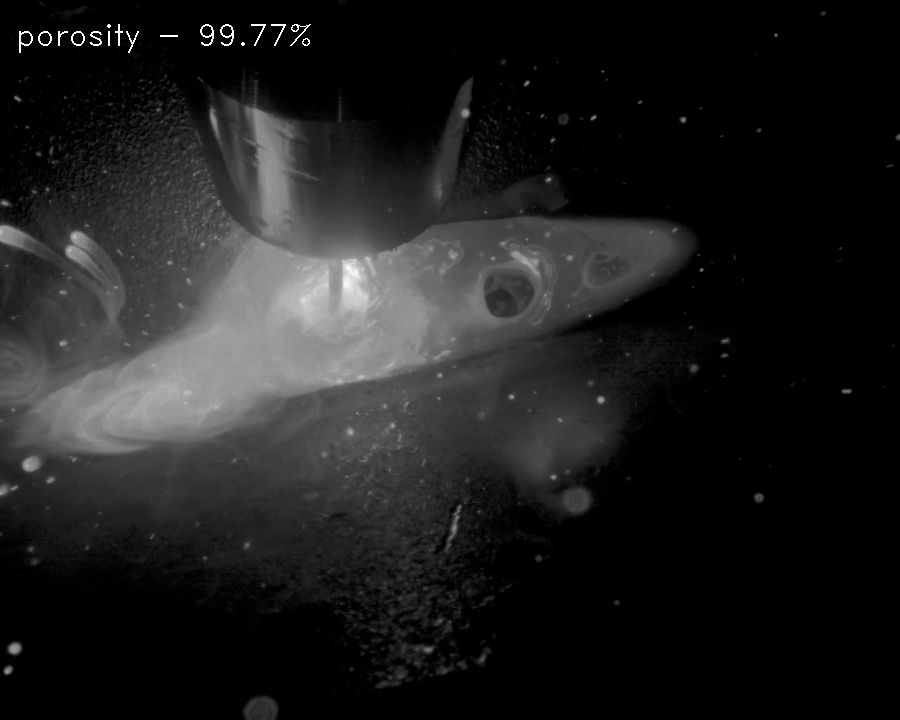

# weld-porosity-detection-0001

## Use Case and High-Level Description

This is a porosity weld recognition model. It runs on a video stream capturing welding tip and reports whether no welding is happening, produced weld is good or weld is porous.

## Example

## Specification

| Metric                          | Value                                     |
|---------------------------------|-------------------------------------------|
| Clip classification accuracy    | 97.14% (internal test set)                |
| Temporal smoothing window size  | 16                                        |
| GFlops                          | 3.636                                     |
| MParams                         | 11.173                                    |
| Source framework                | PyTorch\*                                 |

## Inputs

Image, name: `input`, shape: `1, 3, 224, 224` in the format `B, C, H, W`, where:

- `B` - batch size
- `C` - number of channels
- `H` - image height
- `W` - image width

Expected color order is `BGR`.

## Outputs

The `features` is a blob with the shape `1, 3` containing logits for three output classes ("no weld", "normal weld" and "porosity").

## Legal Information
[\*] Other names and brands may be claimed as the property of others.
