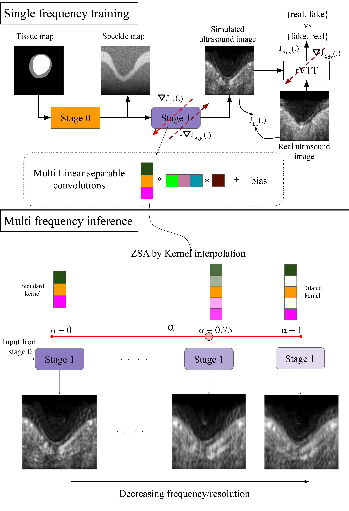

# Multi-frequncy Ultrasound Simulation
## **Use Case and High-Level Description**

Ultrasound simulators are used by clinicians and by the scientific community of practitioners and educators. Ultrasound image formation depends on factors like frequency and size of the transducer, tissue characteristics, nonlinear attenuation, diffraction, and scattering due to the medium. Prior approaches try to incorporate various factors by modelling their physics and solving wave equations, leading to computationally expensive solutions. In this work, we propose a fast simulation approach using Convolutional Neural Network (CNN) to model the non-linearity of signal interaction with ultrasound image formation. The network is trained in an adversarial manner using a Turing test discriminator. The simulation process consists of two stages; Stage 0 is a pseudo-B-mode simulator that provides an initial estimate of the speckle map, Stage 1 is a multi-linear separable CNN which further refines the speckle map to give the final output. 
We further derive the relationship between the frequency of the transducer and the resolution of the ultrasound image to be able to simulate and form images at frequencies other than at which the model is trained. This is achieved by interpolation between dilated kernels in a multi-linear separable CNN used to control the resolution of the generated image allowing for zero-shot adaptation. Using the multi-linear separable design,, we can simulate entire 3D volumes by training the model only on 2D ultrasound images. 
Given a  CNN trained on a  2D ultrasound dataset acquired using a transducer of a particular frequency, we can simulate ultrasound images and 3D volumes corresponding to various transducer frequencies without the need for availability of additional training data in 3D and at a different frequency. We also demonstrate the ability to simulate ultrasound images of breast tumour using a model trained on IVUS dataset. We have performed an extensive validation of our approach using both real and simulated ultrasound images. Using regression analysis, we have concluded that there exists a linear relationship between the proposed kernel interpolation factor and the transducer frequency, thereby laying the foundation of a multi-frequency full 3D ultrasound volume simulator.

## Proposed Approach

## Results

## Datasets
The network is trained on [IVUS](http://www.cvc.uab.es/IVUSchallenge2011/dataset.html) dataset. Data augmentation is applied as explain in [1,2,3] and images are processed by [stage 0](https://in.mathworks.com/matlabcentral/fileexchange/34199-pseudo-b-mode-ultrasound-image-simulator). We have directly provided the processed dataset [here]([link](https://drive.google.com/drive/folders/1d4iu2OHxSaORK4mPXqb0Wy2ivXbXZIdI?usp=sharing)). 

Segmentation masks from [INbreast](http://medicalresearch.inescporto.pt/breastresearch/index.php/Get_INbreast_Database) dataset is used to generate stage 0 simulation results for breast ultrasound.

## Acknowledgement

This work is undertaken as part of Intel India Grand Challenge 2016 Project MIRIAD: Many Incarnations of Screening of Radiology for High Throughput Disease Screening via Multiple Instance Reinforcement Learning with Adversarial Deep Neural Networks, sponsored by Intel Technology India Pvt. Ltd., Bangalore, India.

**Contributor**

[Vidit Goel](https://vidit98.github.io/) 
Department of Electrical Engineering, 
Indian Institute of Technology Kharagpur 
email: vidit.goel9816@gmail.com 

[Rakshith Sathish]((https://www.rakshithsathish.me/)) 
Advanced Technology Development Center,  
Indian Institute of Technology Kharagpur 
email: rakshith.sathish@gmail.com

**Principal Investigators**

<a href="https://www.linkedin.com/in/debdoot/">Dr Debdoot Sheet</a>, <a href="http://www.iitkgp.ac.in/department/EE/faculty/ee-nirmalya">Dr Nirmalya Ghosh</a>, 

Department of Electrical Engineering, 
Indian Institute of Technology Kharagpur 
email: debdoot@ee.iitkgp.ac.in, nirmalya@ee.iitkgp.ac.in

<a href="https://www.linkedin.com/in/ramanathan-sethuraman-27a12aba/">Dr Ramanathan Sethuraman</a>, 
Intel Technology India Pvt. Ltd. 
email: ramanathan.sethuraman@intel.com

## Publications
 1. Vidit Goel, Harsh Maheshwari, Raj Krishan Ghosh, Anand Mooga, Ramanathan Sethuraman, Debdoot Sheet "Fast Simulation of Ultrasound Images using Multilinear Separable Deep Convolution Neural Network with Kernel Dilation" submitted in IEEE Transactions on Ultrasonics, Ferroelectrics, and Frequency Control (under review)
 2. Anand Mooga, Ramanathan Sethuraman, Debdoot Sheet "Zero-Shot Adaptation to Simulate 3D Ultrasound Volume by Learning a Multilinear Separable 2D Convolutional Neural Network" in 2020 IEEE 17th International Symposium on Biomedical Imaging [[link](https://ieeexplore.ieee.org/abstract/document/9098479/)]
 3. Francis Tom, Debdoot Sheet "Simulating Patho-realistic Ultrasound Images using Deep Generative Networks with Adversarial Learning" in 2018 IEEE 15th International Symposium on Biomedical Imaging [[link](https://arxiv.org/abs/1712.07881)]
