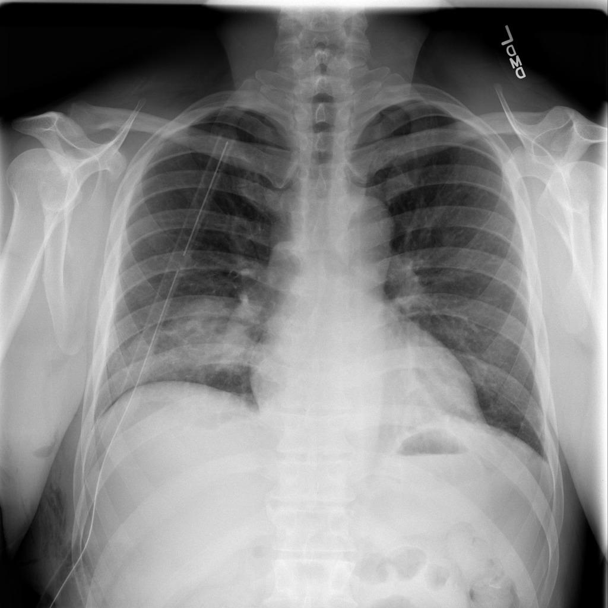
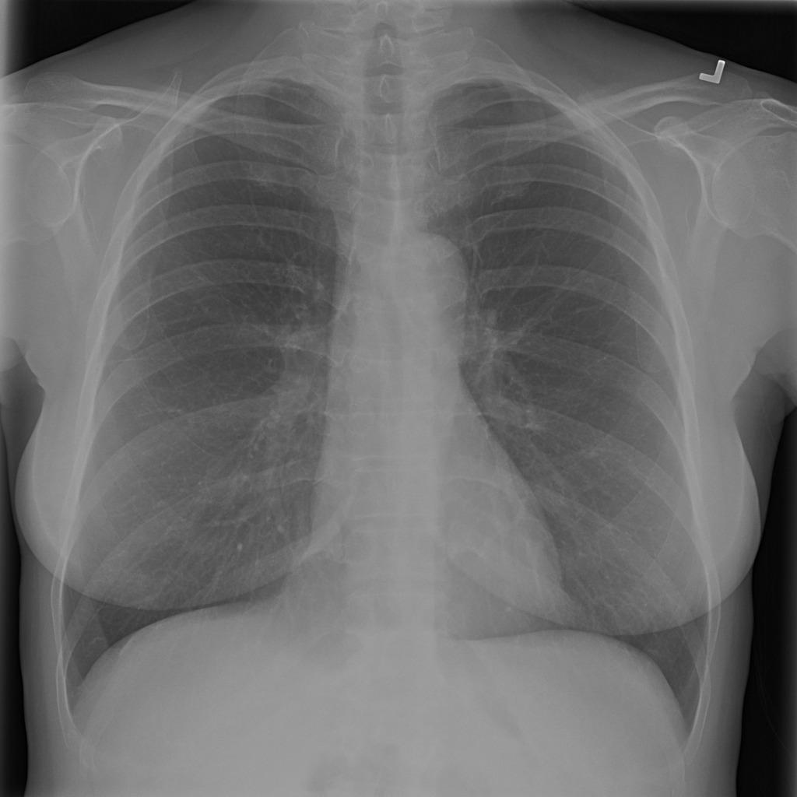
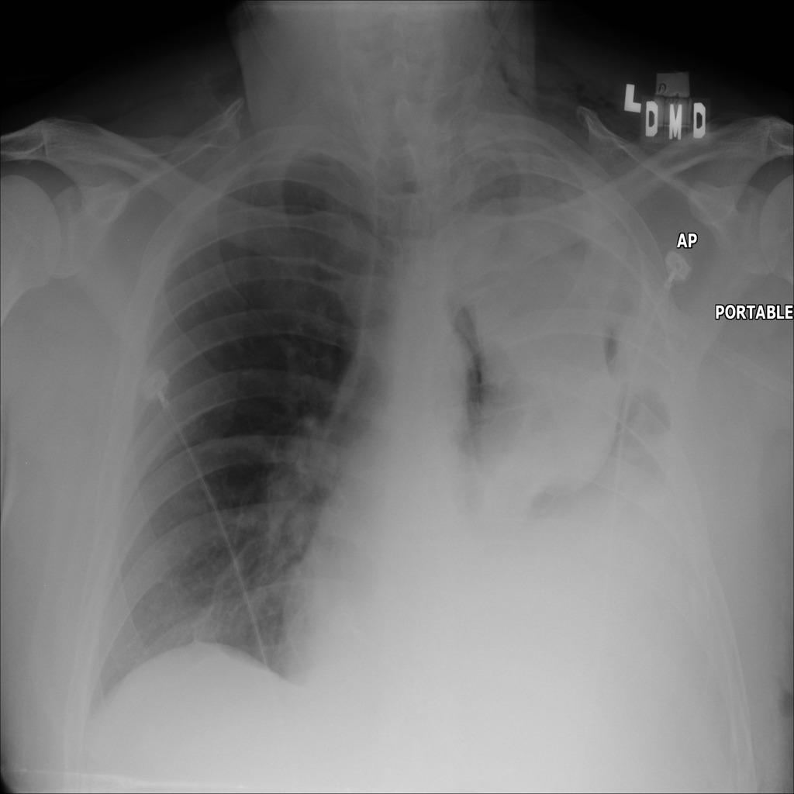
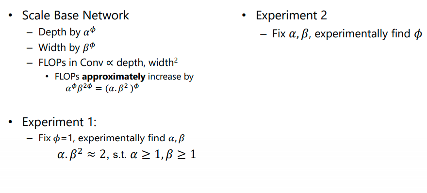

# **Deep Neural Network for Chest X-Ray Screening**

## Use Case and High-Level Description

<div id="abs">

Chest radiographs are primarily employed for the screening of pulmonary and cardio-thoracic conditions. Being undertaken at primary healthcare centers, they require the presence of an on-premise reporting Radiologist, which is a challenge in low and middle income countries. This has inspired the development of machine learning based automation of the screening process. While recent efforts demonstrate a performance benchmark using an ensemble of deep convolutional neural networks (CNN), our systematic search over multiple standard CNN architectures identified single candidate CNN models whose classification performances were found to be at par with ensembles.

Models provided are trained to detect multiple chest diseases in chest X-rays. The model is based on the corresponding paper[[2](#embc)]. The model in this repository differs from the paper in a few aspects; In the paper, the authors classify an X-ray image into one or more of the 14 classes following a multi-hot encoding on account of co-morbidity of diseases, while in this repository we provide a model to classify a Chest X-ray image into any of the applicable 3 classes. 
</div>


## Dataset

The model is trained using the publicly available 2018 RSNA Pneumonia Detection Challenge dataset ([link](https://www.rsna.org/education/ai-resources-and-training/ai-image-challenge/rsna-pneumonia-detection-challenge-2018)[license](https://www.rsna.org/-/media/Files/RSNA/Education/AI-resources-and-training/AI-image-challenge/pneumonia-detection-challenge-terms-of-use-and-attribution.ashx?la=en&hash=FF7A635F6DFFAD31A30C8715DFA3B8FC21131543)).

Dataset preprocessing and training scripts are provided [here](https://github.com/Rakshith2597/training_extensions/tree/develop/misc/pytorch_toolkit/chest_xray_screening)

Few example images from the dataset
<table >
<tr>
<td align='center'> Class 0 (Lung Opacity)</td>
<td align='center'> Class 1 (Normal)</td>
<td align='center'> Class 2 (No Lung Opacity/ Not Normal)</td>
</tr>
<tr>
<td align='center'></td>
<td align='center'> </td>
<td align='center'>  </td>
</tr>
</table>


## Network Architecture

We have used a DenseNet-121 as the base architecture.


A systematic search was performed over a set of CNN architectures by scaling the width and depth of the standard DenseNet using the EfficientNet approach[[3](#efficientnet)]. The details of our experiments based on EfficientNet is summarized in the image below.



Scaling factors `alpha`, `beta`, and `phi` values obtained for CheXpert dataset was used to scale the network. 

| Variable | Value |
| -- | -- |
| α | 1.833 |
| β | 1.044 |
| ϕ | -0.10 | 

## Example

An example for using the onnx models shared in this repository is available [here](https://drive.google.com/file/d/1FCG9EaslKa_n_OF6FpcPlNy9Q3NNY4Rn/view?usp=sharing).

## Specification and Performance

The optimized DenseNet CNN model obtained through EfficientNet based architecture search is provided in this repository. The performance is measured using the average Area under the ROC curves (AUROC) across three classes.

| Type | Classification |
| --- | --- |
| Source Framework | Pytorch (converted to ONNX) |
| GFLOPs | 6.85 |
| Mparams | 7.13 |
| Avg. AUROC | 0.5531 |

> Note: The network was trained using the same  `alpha`, `beta`, and `phi` values obtained for CheXpert dataset. The same model provides an AUROC value of 0.8010 when it is trained and tested using CheXpert dataset.

## Input

The input grayscale image is replicated to three channels. Each of the 3 image channels is normalized to match the distribution of the Image-Net dataset. The order of the dimensions for the input is (B, C, H, W) where B is the batch size, C is the number of channels and H, W is the spatial dimensions of the image.

Shape: `1, 3, 1024, 1024`, format is `B, C, H, W`
- `B` - batch size
- `C` - channel
- `H` - height
- `W` - width

### Output

Outputs the prediction scores in the range of [0,1] for the three disease classes. We pose the Chest radiograph screening as a classification task. The ordering of the disease classes is listed below:

| Class |
| --- |
| Lung Opacity |
| Normal |
| No Lung Opacity/ Not Normal |

## Acknowledgement
This work is undertaken as part of Intel India Grand Challenge 2016 Project MIRIAD: Many Incarnations of Screening of Radiology for High Throughput Disease Screening via Multiple Instance Reinforcement Learning with Adversarial Deep Neural Networks, sponsored by Intel Technology India Pvt. Ltd., Bangalore, India.

## References

<div id="densenet">
<a href="#abs">[1]</a> Huang, Gao, Zhuang Liu, Laurens Van Der Maaten, and Kilian Q. Weinberger. Densely connected convolutional networks. In Proceedings of the IEEE conference on computer vision and pattern recognition_, pp. 4700-4708. 2017. <a href="https://arxiv.org/pdf/1608.06993.pdf"> (link) </a> 
</div>

<div id="embc">
<a href="#abs">[2]</a> A. Mitra, A. Chakravarty, N. Ghosh, T. Sarkar, R. Sethuraman and D. Sheet, "A Systematic Search over Deep Convolutional Neural Network Architectures for Screening Chest Radiographs," 2020 42nd Annual International Conference of the IEEE Engineering in Medicine & Biology Society (EMBC), Montreal, QC, Canada, 2020, pp. 1225-1228, doi: 10.1109/EMBC44109.2020.9175246. <a href="https://ieeexplore.ieee.org/document/9175246"> (link) </a>

</div>

<div id="efficientnet">
<a href="#abs">[3]</a>  Tan, Mingxing, and Quoc V. Le. &quot;EfficientNet: Rethinking model scaling for convolutional neural networks.&quot; , ICML, pp. 6105-6114. 2019. <a href="http://proceedings.mlr.press/v97/tan19a/tan19a.pdf"> (link) </a>

</div>

<div id="chexpert">
<a href="#abs">[4]</a>  Irvin, Jeremy, Pranav Rajpurkar, Michael Ko, Yifan Yu, Silviana Ciurea-Ilcus, Chris Chute, Henrik Marklund et al. &quot;Chexpert: A large chest radiograph dataset with uncertainty labels and expert comparison.&quot; In _Proceedings of the AAAI Conference on Artificial Intelligence_, vol. 33, pp. 590-597. 2019. <a href="https://arxiv.org/abs/1901.07031"> (link) </a>
</div>

<div id="rsnadataset">
<a href=#>[5] </a>George Shih , Carol C. Wu, Safwan S. Halabi, Marc D. Kohli, Luciano M. Prevedello, 
Tessa S. Cook, Arjun Sharma, Judith K. Amorosa, Veronica Arteaga, Maya GalperinAizenberg, Ritu R. Gill, Myrna C.B. Godoy, Stephen Hobbs, Jean Jeudy, Archana 
Laroia, Palmi N. Shah, Dharshan Vummidi, Kavitha Yaddanapudi, Anouk Stein, 
Augmenting the National Institutes of Health Chest Radiograph Dataset with Expert 
Annotations of Possible Pneumonia, Radiology: AI, January 30, 2019, https://doi.org/10.1148/ryai.2019180041
</div>

</br> 

## **Legal Information**
```
The model is distributed under theApache License, Version 2.0
Copyright (c) 2020 Debdoot Sheet, Ramanathan Sethuraman
Contact details:
debdoot@ee.iitkgp.ac.in
ramanathan.sethuraman@intel.com 

Licensed under the Apache License, Version 2.0 (the "License"); you may not use this file except in compliance with the License. You may obtain a copy of the License at http://www.apache.org/licenses/LICENSE-2.0

Unless required by applicable law or agreed to in writing, software distributed under the License is distributed on an "AS IS" BASIS, WITHOUT WARRANTIES OR CONDITIONS OF ANY KIND, either express or implied.
See the License for the specific language governing permissions and limitations under the License.
```