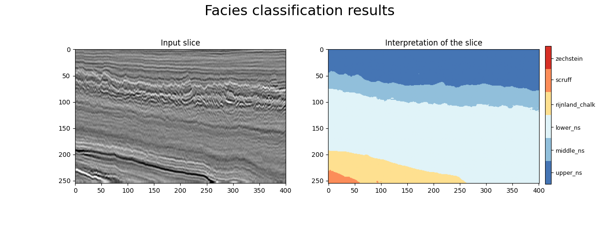

# conv-deconvnet 

## Use Case and High-Level Description

The `conv-decondnet` model is designed to perform facies classification. The model has been pretrained on [this](https://drive.google.com/drive/folders/0B7brcf-eGK8CbGhBdmZoUnhiTWs) dataset. For details about the dataset and model, check out the [Original model repository](https://github.com/yalaudah/facies_classification_benchmark).

The model input is a blob that consists of a single array with the [1x255x401] shape

The model output for `conv-deconvnet` is a typical object-classifier output for six different classifications matching each input pixel.

### Steps to Reproduce PyTorch to ONNX Conversion
Model is provided in ONNX format, which was obtained by the following steps.

1. Clone the original repository
```sh
git clone https://github.com/yalaudah/facies_classification_benchmark.git
cd facies_classification_benchmark
```
2. Checkout the commit that the conversion was tested on:
```sh
git checkout 2d03135
```
3. Apply the `pytorch-onnx.patch` patch
```sh
git apply /path/to/pytorch-onnx.patch
```
4. Install requirements by the following command:
```sh
pip install -r requirements.txt
```
5. Download the [pretrained weights] <-(link)
6. Run
```sh
python torch2onnx.py -i /path/to/downloaded/weights.pth
```

## Example



## Specification

| Metric            | Value         |
|-------------------|---------------|
| Type              | Classification|
| GFLOPs            | 141.62        |
| MParams           | 84.03         |
| Source framework  | PyTorch\*     |

## Accuracy

| Metric | Original model | Converted model |
| ------ | -------------- | --------------- |
| MEAN AC| 0.827          | -               |
| FWIU   | 0.860          | -               |

See [the original model's documentation] <- (link).
## Performance

## Input

### Original model

Image, name - `data`, shape - `1, 1, 255, 401`, format is `B,C,H,W` where:

- `B` - batch size
- `C` - channel
- `H` - height
- `W` - width

Mean value - `0.000941`, scale value - `1`.

### Converted model

Image, name - `data`, shape - `1, 1, 255, 401`, format is `B,C,H,W` where:

- `B` - batch size
- `C` - channel
- `H` - height
- `W` - width

### Original model

Image, name - `data`, shape - `1, 1, 255, 401`, format is `B,C,H,W` where:

- `B` - batch size
- `C` - channel
- `H` - height
- `W` - width

## Output

### Original model

Object classifier according to facies classes, name - `prob`,  shape - `1,255,401,6`, output data format is `B,H,W,C` where:

- `B` - batch size
- `H` - height size
- `W` - width size
- `C` - predicted value, soft-max is required to transfer to the probabilities for each class in the [0, 1] range

### Converted model

Object classifier according to facies classes, name - `prob`,  shape - `1,255,401,6`, output data format is `B,H,W,C` where:

- `B` - batch size
- `H` - height size
- `W` - width size
- `C` - predicted value, soft-max is required to transfer to the probabilities for each class in the [0, 1] range

## Legal Information

The original model is distributed under the following
[license](https://github.com/yalaudah/facies_classification_benchmark/blob/master/LICENSE)

```
MIT License

Copyright (c) 2017 Meet Pragnesh Shah 

Permission is hereby granted, free of charge, to any person obtaining a copy
of this software and associated documentation files (the "Software"), to deal
in the Software without restriction, including without limitation the rights
to use, copy, modify, merge, publish, distribute, sublicense, and/or sell
copies of the Software, and to permit persons to whom the Software is
furnished to do so, subject to the following conditions:

The above copyright notice and this permission notice shall be included in all
copies or substantial portions of the Software.

THE SOFTWARE IS PROVIDED "AS IS", WITHOUT WARRANTY OF ANY KIND, EXPRESS OR
IMPLIED, INCLUDING BUT NOT LIMITED TO THE WARRANTIES OF MERCHANTABILITY,
FITNESS FOR A PARTICULAR PURPOSE AND NONINFRINGEMENT. IN NO EVENT SHALL THE
AUTHORS OR COPYRIGHT HOLDERS BE LIABLE FOR ANY CLAIM, DAMAGES OR OTHER
LIABILITY, WHETHER IN AN ACTION OF CONTRACT, TORT OR OTHERWISE, ARISING FROM,
OUT OF OR IN CONNECTION WITH THE SOFTWARE OR THE USE OR OTHER DEALINGS IN THE
SOFTWARE.
```
