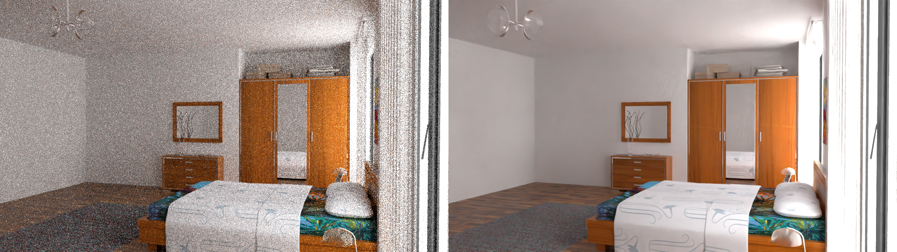

# denoise-rt-hdr-alb

## Use Case and High-Level Description

It denoise the Monte Carlo noise inherent to stochastic ray tracing methods like path tracing, reducing the amount of necessary samples per pixel by even multiple orders of magnitude (depending on the desired closeness to the ground truth)

More details provided in the [repository](https://github.com/OpenImageDenoise/oidn).

## Example

Example for denoising image (left - source image, right - image after denoising):

## Specification
Accuracy metrics are obtained on [Tungsten dataset](https://sites.google.com/view/bilateral-grid-denoising/home/supplemental-material-dataset)
.

| Metric           | Value     |
|------------------|-----------|
| SSIM             | 0.99      |
| GFlops           | 12.3637   |
| MParams          | 0.9173    |
| Source framework | PyTorch\* |

## Inputs

1. Image, name: `color`, dynamic shape in the format `B, C, H, W`, where:

    - `B` - batch size
    - `C` - number of channels
    - `H` - image height
    - `W` - image width

2. Image, name: `albedo`, dynamic shape in the format `B, C, H, W`, where:

    - `B` - batch size
    - `C` - number of channels
    - `H` - image height
    - `W` - image width

Image `color` and `albedo` should have the same shape.

## Outputs
The net output is a blob with same shapes in the input image with format `B, C, H, W`, where:

   - `B` - batch size
   - `C` - number of channels
   - `H` - image height
   - `W` - image width

## Demo usage

The model can be used in the following demos provided by the Open Model Zoo to show its capabilities:

* [Denoise Render Demo](../../../demos/denoise_ray_tracing_demo/python/README.md)

## Legal Information
[*] Other names and brands may be claimed as the property of others.
