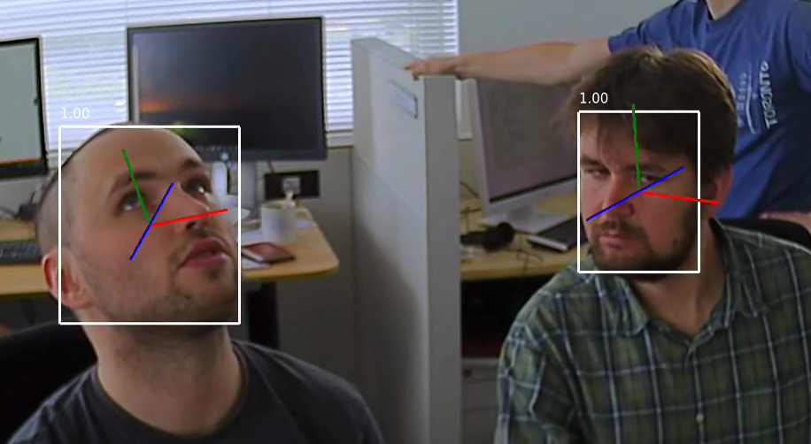

# face-detection-retail-0044

## Use Case and High-Level Description

Face detector based on SqueezeNet light (half-channels) as a backbone with a
single SSD for indoor/outdoor scenes shot by a front-facing camera. The backbone
consists of fire modules to reduce the number of computations. The single SSD
head from 1/16 scale feature map has nine clustered prior boxes.

## Example



## Specification

| Metric                                                        | Value                   |
|---------------------------------------------------------------|-------------------------|
| AP ([WIDER](http://shuoyang1213.me/WIDERFACE/))               | 83.00%                  |
| GFlops                                                        | 1.067                   |
| MParams                                                       | 0.588                   |
| Source framework                                              | Caffe\*                 |

Average Precision (AP) is defined as an area under the
[precision/recall](https://en.wikipedia.org/wiki/Precision_and_recall)
curve. All numbers were evaluated by taking into account only faces bigger than
60 x 60 pixels.

## Inputs

### Original Model

Image, name: `input`, shape: `1, 3, 300, 300`, format `B, C, H, W`, where:

- `B` - batch size
- `C` - number of channels
- `H` - image height
- `W` - image width

Expected color order: `BGR`.

### Converted Model

Image, name: `input`, shape: `1, 3, 300, 300`, format `B, C, H, W`, where:

- `B` - batch size
- `C` - number of channels
- `H` - image height
- `W` - image width

Expected color order: `BGR`.

## Outputs

### Original Model

The net outputs a blob with shape: `1, 1, 200, 7` in the format `1, 1, N, 7`, where `N` is the number of detected
bounding boxes. For each detection, the description has the format:
[`image_id`, `label`, `conf`, `x_min`, `y_min`, `x_max`, `y_max`], where:

- `image_id` - ID of the image in the batch
- `label` - predicted class ID
- `conf` - confidence for the predicted class
- (`x_min`, `y_min`) - coordinates of the top left bounding box corner
- (`x_max`, `y_max`) - coordinates of the bottom right bounding box corner.

### Converted Model

The net outputs a blob with shape: `1, 1, 200, 7` in the format `1, 1, N, 7`, where `N` is the number of detected
bounding boxes. For each detection, the description has the format:
[`image_id`, `label`, `conf`, `x_min`, `y_min`, `x_max`, `y_max`], where:

- `image_id` - ID of the image in the batch
- `label` - predicted class ID
- `conf` - confidence for the predicted class
- (`x_min`, `y_min`) - coordinates of the top left bounding box corner
- (`x_max`, `y_max`) - coordinates of the bottom right bounding box corner.

## Download a Model and Convert it into Inference Engine Format

You can download models and if necessary convert them into Inference Engine format using the [Model Downloader and other automation tools](../../../tools/downloader/README.md) as shown in the examples below.

An example of using the Model Downloader:
```
python3 <omz_dir>/tools/downloader/downloader.py --name <model_name>
```

An example of using the Model Converter:
```
python3 <omz_dir>/tools/downloader/converter.py --name <model_name>
```

## Legal Information

The original model is distributed under the
[Apache License, Version 2.0](https://raw.githubusercontent.com/opencv/training_toolbox_caffe/develop/LICENSE).
A copy of the license is provided in [APACHE-2.0.txt](../licenses/APACHE-2.0.txt).

[*] Other names and brands may be claimed as the property of others.
