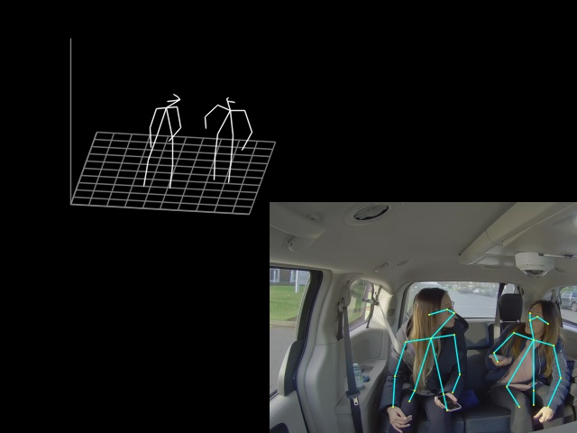

# human-pose-estimation-3d-0001

## Use Case and High-Level Description

Multi-person 3D human pose estimation model based on the [Lightweight OpenPose](https://arxiv.org/abs/1811.12004) and [Single-Shot Multi-Person 3D Pose Estimation From Monocular RGB](https://arxiv.org/abs/1712.03453) papers.

## Example



## Specification

| Metric                                                        | Value                   |
|---------------------------------------------------------------|-------------------------|
| MPJPE (mm)                                                    | 100.45                  |
| GFlops                                                        | 18.998                  |
| MParams                                                       | 5.074                   |
| Source framework                                              | PyTorch\*               |

## Inputs

Image, name: `data`, shape: `1, 3, 256, 448` in the `B, C, H, W` format, where:

- `B` - batch size
- `C` - number of channels
- `H` - image height
- `W` - image width

Expected color order is `BGR`.

## Outputs

The net outputs are three blobs:

1. Name: `features`, shape: `1, 57, 32, 56` - coordinates in 3D space.
2. Name: `heatmaps`, shape: `1, 19, 32, 56` - keypoint heatmaps.
3. Name: `pafs`, shape: `1, 38, 32, 56` - keypoint pairwise relations (part affinity fields).

## Download a Model and Convert it into Inference Engine Format

You can download models and if necessary convert them into Inference Engine format using the [Model Downloader and other automation tools](../../../tools/downloader/README.md) as shown in the examples below.

An example of using the Model Downloader:
```
python3 <omz_dir>/tools/downloader/downloader.py --name <model_name>
```

An example of using the Model Converter:
```
python3 <omz_dir>/tools/downloader/converter.py --name <model_name>
```

## Legal Information

The original model is distributed under the
[Apache License, Version 2.0](https://raw.githubusercontent.com/opencv/openvino_training_extensions/develop/LICENSE).
A copy of the license is provided in [APACHE-2.0.txt](../licenses/APACHE-2.0.txt).

[*] Other names and brands may be claimed as the property of others.
