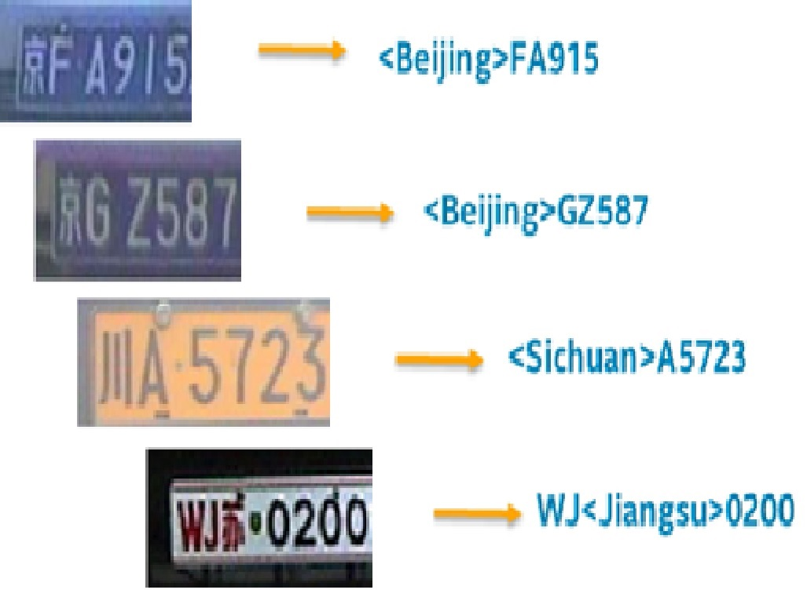

# license-plate-recognition-barrier-0007

## Use Case and High-Level Description

This model uses a small-footprint network trained end-to-end to recognize
Chinese license plates in traffic.

## Validation Dataset - Internal

300320 Sythetic Chinese plates i.e. the plate text on them consists of symbols generated randomly (but to conform to the plate requirements in terms of the number of characters, sequence, shape, placement, etc.). The "real-looking" appearance of the plates (rotation, dirt, color, lighting, etc.) is achieved by a style transfer procedure.

## Example

**Note:** The license plates on the image were modified to protect the owners' privacy.



## Specification

| Metric                 | Value                   |
|------------------------|-------------------------|
| Rotation in-plane      | ±10˚                    |
| Rotation out-of-plane  | Yaw: ±45˚ / Pitch: ±45˚ |
| Min plate width        | 94 pixels               |
| Ratio of correct reads | 98%                     |
| GFlops                 | 0.347                   |
| MParams                | 1.435                   |
| Source framework       | TensorFlow\*            |

## Limitations

Only "blue" license plates, which are common in public, were tested
thoroughly. Other types of license plates may underperform.

## Inputs

### Original Model

Image,	name: `input`, shape: `1, 24, 94, 3`, format is `1, H, W, C`, where:

- `C` - channel
- `H` - height
- `W` - width

Channel order is `BGR`.

### Converted Model

Image,	name: `input`, shape: `1, 24, 94, 3`, format is `1, H, W, C`, where:

- `C` - channel
- `H` - height
- `W` - width

Channel order is `BGR`.

## Outputs

### Original Model

Encoded vector of floats, name: `d_predictions`, shape: `1, 88, 1, 1`. Each float
is an integer number encoding a character according to this dictionary:

        0 0
        1 1
        2 2
        3 3
        4 4
        5 5
        6 6
        7 7
        8 8
        9 9
        10 <Anhui>
        11 <Beijing>
        12 <Chongqing>
        13 <Fujian>
        14 <Gansu>
        15 <Guangdong>
        16 <Guangxi>
        17 <Guizhou>
        18 <Hainan>
        19 <Hebei>
        20 <Heilongjiang>
        21 <Henan>
        22 <HongKong>
        23 <Hubei>
        24 <Hunan>
        25 <InnerMongolia>
        26 <Jiangsu>
        27 <Jiangxi>
        28 <Jilin>
        29 <Liaoning>
        30 <Macau>
        31 <Ningxia>
        32 <Qinghai>
        33 <Shaanxi>
        34 <Shandong>
        35 <Shanghai>
        36 <Shanxi>
        37 <Sichuan>
        38 <Tianjin>
        39 <Tibet>
        40 <Xinjiang>
        41 <Yunnan>
        42 <Zhejiang>
        43 <police>
        44 A
        45 B
        46 C
        47 D
        48 E
        49 F
        50 G
        51 H
        52 I
        53 J
        54 K
        55 L
        56 M
        57 N
        58 O
        59 P
        60 Q
        61 R
        62 S
        63 T
        64 U
        65 V
        66 W
        67 X
        68 Y
        69 Z

### Converted Model

Encoded vector of integers, name: `d_predictions:0`, shape: `1, 88`. Each value
is an integer number encoding a character according to this dictionary:

        0 0
        1 1
        2 2
        3 3
        4 4
        5 5
        6 6
        7 7
        8 8
        9 9
        10 <Anhui>
        11 <Beijing>
        12 <Chongqing>
        13 <Fujian>
        14 <Gansu>
        15 <Guangdong>
        16 <Guangxi>
        17 <Guizhou>
        18 <Hainan>
        19 <Hebei>
        20 <Heilongjiang>
        21 <Henan>
        22 <HongKong>
        23 <Hubei>
        24 <Hunan>
        25 <InnerMongolia>
        26 <Jiangsu>
        27 <Jiangxi>
        28 <Jilin>
        29 <Liaoning>
        30 <Macau>
        31 <Ningxia>
        32 <Qinghai>
        33 <Shaanxi>
        34 <Shandong>
        35 <Shanghai>
        36 <Shanxi>
        37 <Sichuan>
        38 <Tianjin>
        39 <Tibet>
        40 <Xinjiang>
        41 <Yunnan>
        42 <Zhejiang>
        43 <police>
        44 A
        45 B
        46 C
        47 D
        48 E
        49 F
        50 G
        51 H
        52 I
        53 J
        54 K
        55 L
        56 M
        57 N
        58 O
        59 P
        60 Q
        61 R
        62 S
        63 T
        64 U
        65 V
        66 W
        67 X
        68 Y
        69 Z

## Download a Model and Convert it into OpenVINO™ IR Format

You can download models and if necessary convert them into OpenVINO™ IR format using the [Model Downloader and other automation tools](../../../tools/model_tools/README.md) as shown in the examples below.

An example of using the Model Downloader:
```
omz_downloader --name <model_name>
```

An example of using the Model Converter:
```
omz_converter --name <model_name>
```

## Demo usage

The model can be used in the following demos provided by the Open Model Zoo to show its capabilities:

* [Security Barrier Camera C++ Demo](../../../demos/security_barrier_camera_demo/cpp/README.md)

## Legal Information
The original model is distributed under the
[Apache License, Version 2.0](https://raw.githubusercontent.com/opencv/openvino_training_extensions/develop/LICENSE).
A copy of the license is provided in `<omz_dir>/models/public/licenses/APACHE-2.0.txt`.

[*] Other names and brands may be claimed as the property of others.
