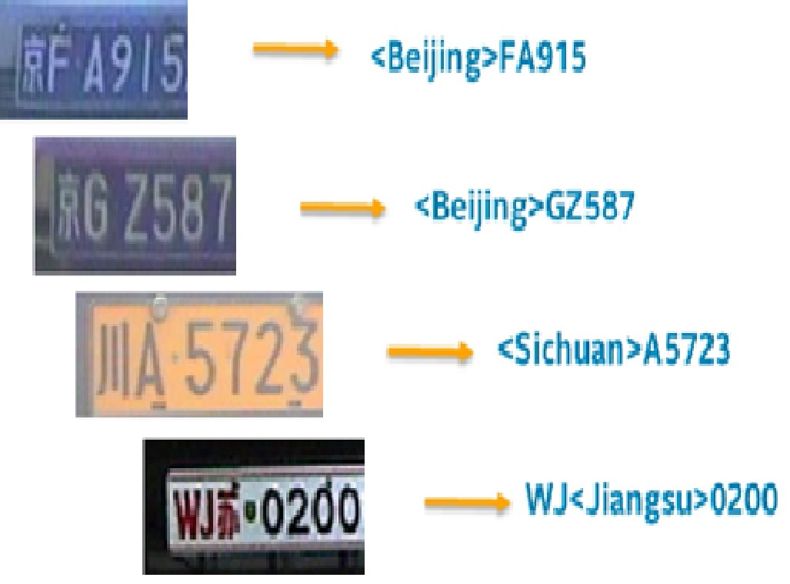

# license-plate-recognition-barrier-0007

## Use Case and High-Level Description

This model uses a small-footprint network trained end-to-end to recognize
Chinese license plates in traffic.

## Validation Dataset - Internal

1165 Chinese plates from different provinces

## Example

**Note:** The license plates on the image were modified to protect the owners' privacy.

## Specification

| Metric                 | Value                   |
|------------------------|-------------------------|
| Rotation in-plane      | ±10˚                    |
| Rotation out-of-plane  | Yaw: ±45˚ / Pitch: ±45˚ |
| Min plate width        | 94 pixels               |
| Ratio of correct reads | 90.12%                  |
| GFlops                 | 0.347                   |
| MParams                | 1.435                   |
| Source framework       | TensorFlow*             |

## Limitations

Only "blue" license plates, which are common in public, were tested
thoroughly. Other types of license plates may underperform.

## Performance

## Inputs

### Original Model

Image,	name: `data` , shape: `1,3,24,94`, format is `1,C,H,W` where:

- `C` - channel
- `H` - height
- `W` - width

Channel order is `BGR`.

### Converted Model

Image,	name: `data` , shape: `1,3,24,94`, format is `1,C,H,W` where:

- `C` - channel
- `H` - height
- `W` - width

Channel order is `BGR`.

## Outputs

### Original Model

Encoded vector of floats, name: `decode`, shape: `1,88,1,1`. Each float
is an integer number encoding a character according to this dictionary:

        0 0
        1 1
        2 2
        3 3
        4 4
        5 5
        6 6
        7 7
        8 8
        9 9
        10 <Anhui>
        11 <Beijing>
        12 <Chongqing>
        13 <Fujian>
        14 <Gansu>
        15 <Guangdong>
        16 <Guangxi>
        17 <Guizhou>
        18 <Hainan>
        19 <Hebei>
        20 <Heilongjiang>
        21 <Henan>
        22 <HongKong>
        23 <Hubei>
        24 <Hunan>
        25 <InnerMongolia>
        26 <Jiangsu>
        27 <Jiangxi>
        28 <Jilin>
        29 <Liaoning>
        30 <Macau>
        31 <Ningxia>
        32 <Qinghai>
        33 <Shaanxi>
        34 <Shandong>
        35 <Shanghai>
        36 <Shanxi>
        37 <Sichuan>
        38 <Tianjin>
        39 <Tibet>
        40 <Xinjiang>
        41 <Yunnan>
        42 <Zhejiang>
        43 <police>
        44 A
        45 B
        46 C
        47 D
        48 E
        49 F
        50 G
        51 H
        52 I
        53 J
        54 K
        55 L
        56 M
        57 N
        58 O
        59 P
        60 Q
        61 R
        62 S
        63 T
        64 U
        65 V
        66 W
        67 X
        68 Y
        69 Z

### Converted Model

Encoded vector of floats, name: `decode`, shape: `1,88,1,1`. Each float
is an integer number encoding a character according to this dictionary:

        0 0
        1 1
        2 2
        3 3
        4 4
        5 5
        6 6
        7 7
        8 8
        9 9
        10 <Anhui>
        11 <Beijing>
        12 <Chongqing>
        13 <Fujian>
        14 <Gansu>
        15 <Guangdong>
        16 <Guangxi>
        17 <Guizhou>
        18 <Hainan>
        19 <Hebei>
        20 <Heilongjiang>
        21 <Henan>
        22 <HongKong>
        23 <Hubei>
        24 <Hunan>
        25 <InnerMongolia>
        26 <Jiangsu>
        27 <Jiangxi>
        28 <Jilin>
        29 <Liaoning>
        30 <Macau>
        31 <Ningxia>
        32 <Qinghai>
        33 <Shaanxi>
        34 <Shandong>
        35 <Shanghai>
        36 <Shanxi>
        37 <Sichuan>
        38 <Tianjin>
        39 <Tibet>
        40 <Xinjiang>
        41 <Yunnan>
        42 <Zhejiang>
        43 <police>
        44 A
        45 B
        46 C
        47 D
        48 E
        49 F
        50 G
        51 H
        52 I
        53 J
        54 K
        55 L
        56 M
        57 N
        58 O
        59 P
        60 Q
        61 R
        62 S
        63 T
        64 U
        65 V
        66 W
        67 X
        68 Y
        69 Z

## Legal Information
The original model is distributed under the
[Apache License, Version 2.0](https://raw.githubusercontent.com/opencv/openvino_training_extensions/develop/LICENSE).
A copy of the license is provided in [APACHE-2.0](../licenses/APACHE-2.0.txt).

[*] Other names and brands may be claimed as the property of others.
